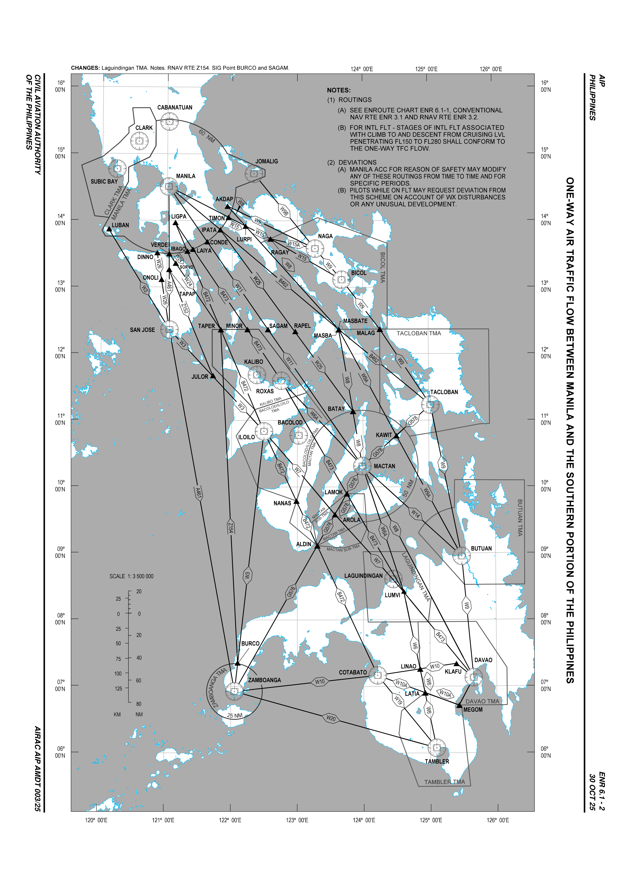

# RPHI Briefing

<figure markdown="span">
  { width="800" }
  <figcaption>RNAV Routes Within RPHI</figcaption>
</figure>

## Frequencies

| Callsign | Frequency |
|---|---|
| MNL_CTR | 119.300 |
| MNL_C_CTR | 132.075 |
| MNL_N_CTR | 126.575 |
| MNL_S_CTR | 133.500 |
| MNL_2_CTR | 124.950 |
| MNL_N1_CTR | 129.000 |
| MNL_S1_CTR | 131.500 |
| MNL_NW_CTR | 128.700 |
| MNL_NE_CTR | 132.500 |
| MNL_CN_CTR | 120.500 |
| MNL_CE_CTR | 128.750 |
| MNL_CS_CTR | 125.700 |
| MNL_CW_CTR | 132.700 |
| MNL_W_CTR | 118.900 |
| MNL_SW_CTR | 124.900 |
| MNL_SE_CTR | 125.750 |

## Manila ACC

## North ACC Combined and South ACC Combined

##  North and South Central ACC Combined

## ACC Split Sectors

## Central ACC Combined

## Manila ACC South Combined

## Strategic Lateral Offset Procedures (SLOP)

### Aircraft Navigation Performance and Airspace Safety

Air Traffic Control applies separation minima, including lateral route spacing, based on the assumption that aircraft operate on the center line of a route. In general, unauthorized deviations from this requirement could compromise safety. However, the use of highly accurate navigation systems [such as Global Navigation Satellite System (GNSS)] reduces the magnitude of lateral deviations from the route center line and consequently increases the probability of a collision if a loss of vertical separation between aircraft on the same route occurs.

By using offsets to provide lateral spacing between aircraft, the effect of this reduction in random
lateral deviations can be mitigated, thereby reducing the risk of collision.

### Strategic Lateral Offsets in Oceanic Airspace

- Offsets are only applied in the oceanic airspace in the Manila FIR.
- Offsets are applied only by aircraft with automatic offset tracking capability.
- The following requirements apply to the use of the offset:
    - The decision to apply a strategic lateral offset is the responsibility of the flight crew.
    - The offset shall be established at a distance of one (1) or two (2) nautical miles to the right of the center line relative to the direction of flight.
    - The strategic lateral offset procedure has been designed to include offsets to mitigate the effects of wake turbulence of preceding aircraft. If wake turbulence needs to be avoided, one of the three available options (center line, 1 NM or 2 NM right offset) shall be used.
    - In airspace where the use of lateral offsets has been authorized, pilots are not required to inform ATC that an offset is being applied.
    - Aircraft transiting areas of radar coverage in airspace where offset tracking is permitted may initiate or continue an offset.

## Phraseology

### Manila Radio

Currently the only radio that can be implemented by Manila Control is MNL_NE_CTR, otherwise known as Manila Oceanic. Under Manila Radio, you can still expect [RVSM](rvsm.md).

When contacting Manila Radio, keep in mind that they will not be able to see you and are purely going off what you give them. It is important to have atleast these four information at hand.

1. Aircraft identification.
2. Position and time
3. Level.
4. Next position and ETA.

!!! phraseology "Phraseology"

    Manila Radio, PAL123, Over BISIG 1300z, FL320, Next EXOMI at 1330z

*[MNL_NE_CTR]: Manila Radio or Manila Control

!!! warning "Warning"

    There are areas within the FIR where Controllers and Pilots will not hear each other due to radio wave propagation.
