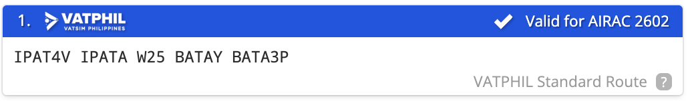

# RPLC - Clark International Airport

## General
The Clark International Airport has 1 commercial Runway and 1 general aviation runway, 2 passenger terminals, 1 military airbase and 1 maintenance hangar

- Terminal 1 - Unused
- Terminal 2 - International and Domestic Flights

The airport caters passenger and cargo flights, as well as general and military aviation.

## Charts
[RPLC](https://vatphil.com/charts?icao=RPLC){ .md-button .md-button--primary }

## Frequency List
<table>
  <thead>
    <tr>
      <th style="text-align:center">Designator</th>
      <th style="text-align:center">Callsign</th>
      <th style="text-align:center">Frequency</th>
      <th style="text-align:center">Remarks</th>
    </tr>
  </thead>
  <tbody>
    <tr>
      <td style="text-align:center"><strong>RPLC_DEL</strong></td>
      <td style="text-align:center">Delivery</td>
      <td style="text-align:center">125.200</td>
      <td style="text-align:center"></td>
    </tr>
    <tr>
      <td style="text-align:center"><strong>RPLC_RMP</strong></td>
      <td style="text-align:center"></td>
      <td style="text-align:center">121.650</td>
      <td style="text-align:center"></td>
    </tr>
    <tr>
      <td style="text-align:center"><strong>RPLC_GND</strong></td>
      <td style="text-align:center"></td>
      <td style="text-align:center">124.300</td>
      <td style="text-align:center"></td>
    </tr>
    <tr>
      <td style="text-align:center"><strong>RPLC_TWR</strong></td>
      <td style="text-align:center"></td>
      <td style="text-align:center">118.700</td>
      <td style="text-align:center"></td>
    </tr>
    <tr>
      <td style="text-align:center"><strong>RPLC_APP</strong></td>
      <td style="text-align:center"></td>
      <td style="text-align:center">119.200</td>
      <td style="text-align:center"></td>
    </tr>
  </tbody>
</table>

## Stand Assignments

Bay assignments, are strictly implemented virtually, and are based on the latest
real-world operations. 

All Domestic and International flights will park at Terminal 2.
Any cargo flights will park at M or N Ramp.
Virtual and other real-world airlines that are not listed will park at terminal 2.

## Runways

Clark currently only has 1 Runway.
Below is a table of the Take-Off Run available

**Take-off Run Available.**
<table>
  <thead>
    <tr>
      <th style="text-align:center">Intersection</th>
      <th style="text-align:center">TORA ft (m)</th>
    </tr>
  </thead>
  <tbody>
    <tr>
      <td style="text-align:center">F1</td>
      <td style="text-align:center">8,432 (2570)</td>
    </tr>
    <tr>
      <td style="text-align:center">F2</td>
      <td style="text-align:center">6,480 (1975)</td>
    </tr>
    <tr>
      <td style="text-align:center">F5</td>
      <td style="text-align:center">7,808 (2380)</td>
    </tr>
  </tbody>
</table>

## Routes

Local flights within RPHI and some international flights are to use routes given below. Simbrief also give a standard route which looks like this

<iframe src="../../assets/pdfs/routes.pdf" width="70%" height="500px""></iframe>

If your route is still invalid, a controller will send you a private message with your new route. Routes within RPHI are to follow the half-moon principle in both RVSM and non-RVSM conditions. During events you will have 5 minutes between the time you request clearance and the time you request pushback, or you will have to wait until a new slot is available.

!!! warning

    During events it is important that you put your EOBT in your flight plan as 
    controllers will use that to determine your takeoff slot.

## Waypoint Restrictions

<h3 style="text-align:center"><strong>Waypoint Restrictions</strong></h3>

<table>
  <thead>
    <tr>
      <th style="text-align:center">FIR</th>
      <th style="text-align:center">Waypoint</th>
      <th style="text-align:center">Airway</th>
      <th style="text-align:center">Altitude (FL)</th>
    </tr>
  </thead>
  <tbody>
    <tr>
      <td style="text-align:center"><strong>HONG KONG</strong></td>
      <td style="text-align:center"><strong>NOMAN / SABNO</strong></td>
      <td style="text-align:center"><strong>A583 / A461 / M501</strong></td>
      <td style="text-align:center"><strong>300 / 340 / 380</strong></td>
    </tr>
    <tr>
      <td rowspan="4" style="text-align:center"><strong>SINGAPORE</strong></td>
      <td style="text-align:center"><strong>TEGID</strong></td>
      <td style="text-align:center"><strong>M767</strong></td>
      <td style="text-align:center"><strong>310 / 320 / 350 / 360 / 390 / 400</strong></td>
    </tr>
    <tr>
      <td rowspan="3" style="text-align:center"><strong>LAXOR</strong></td>
      <td style="text-align:center"><strong>L649</strong></td>
      <td style="text-align:center"><strong>300 / 380</strong></td>
    </tr>
    <tr>
      <td style="text-align:center"><strong>M772</strong></td>
      <td style="text-align:center"><strong>300 / 380</strong></td>
    </tr>
    <tr>
      <td style="text-align:center"><strong>N884</strong></td>
      <td style="text-align:center"><strong>320 / 360 / 400</strong></td>
    </tr>
    <tr>
      <td rowspan="3" style="text-align:center"><strong>HO CHI MINH</strong></td>
      <td rowspan="2" style="text-align:center"><strong>PANDI / ARESI</strong></td>
      <td style="text-align:center"><strong>M765 / L628</strong></td>
      <td style="text-align:center"><strong>280 / 340</strong></td>
    </tr>
    <tr>
      <td style="text-align:center"><strong>N500</strong></td>
      <td style="text-align:center"><strong>300</strong></td>
    </tr>
    <tr>
      <td style="text-align:center"><strong>MIGUG</strong></td>
      <td style="text-align:center"><strong>N892</strong></td>
      <td style="text-align:center"><strong>310 / 320 / 350 / 360 / 390 / 400</strong></td>
    </tr>
  </tbody>
</table>

## Clearance

On first contact with the controller that will issue your clearance, it is recommended for you to give
the following information:

- Your bay number
- Your aircraft type
- The ATIS information letter

??? phraseology "Phraseology"

    **SRQ6355**: Clearance Delivery, SRQ6355, stand 205, A-T-R 72, with Information Alpha, request clearance El Nido

!!! warning

    Radio Checks on first contact are **discouraged** when building communication with the controller. 
    It's best to greet or ask the controller, should you need any help before clearance issuance.

    Be straightforward and concise as possible when communicating within a controlled frequency. 

Once you have requested for clearance, the controller will either tell you to standby, or give your clearance on the spot. Clearances include your routing, flight level restrictions, departure instructions and your squawk.

You must read back the clearance in full. Listen carefully to all details that the controller gives you, and if you are unsure about your clearance, **let the controller know.**

??? phraseology "Phraseology"

    === "Non-Radar"

        **GAP2010**: Clearance Delivery, GAP2010, Stand 208, Q-400 with information A, request clearance Mactan

        **RPLC_DEL**: GAP2010, cleared Mactan, W16 MIA B462 IPATA W25 BATAY, RUNWAY 02 OLIVA2E, Climb 4000, Squawk 4250

    === "Radar"

        **GAP2010**: Clearance Delivery, GAP2010, Stand 208, Q-400 with information A, request clearance Mactan

        **RPLC_DEL**: GAP2010, cleared Mactan, W16 MIA B462 IPATA W25 BATAY, RUNWAY 02, fly runway heading, climb 4000ft, expect radar vectors OLIVA, squawk 4250

## Pushback

!!! warning 

    1. **Do not preplan your pushback!**
    2. Connect the tug first!

??? phraseology "Phraseology"

    **GAP2010**: Clark Ramp, GAP2010, Stand 208, request push and start

    **RPLC_RMP**: GAP2010, push and start approved, face south

## Departure

The departure procedure is decided by an online Approach (**APP**) or En-route Controller (**CTR**). When both are offline, Standard Instrument Departures (**SIDs**) are given by the aerodrome controllers (**TWR**, **GND** or **DEL**). When either **APP** or **CTR** is online, they decide if departures will be given radar vectors (climb and heading instructions) to the TMA exit points or will be following a **SID**.

When **APP** or **CTR** is online, after passing 2000 feet or 5 DME from RPLL, report your passing altitude to **APP**  or **CTR**. This is to help them identify you successfully in their radar screens.

??? phraseology "Phraseology"

    **GAP2010**: Manila Departure, GAP2010, on runway heading, passing 2000 climbing 4000

    **RPLC_APP**: GAP2010, radar identified, continue climb 7000

## Arrival

When arriving in to Clark, it is best for you to be in between 7,000ft and FL140 when reaching the border of the TMA or the start of the [STAR](https://learn.vatphil.com/briefings/arrival/star/). On initial contact with Clark Approach (RPLC_APP), report your current level.

??? phraseology "Phraseology"

    **GAP2024**: Clark Approach, GAP2024, FL160, inbound MALIB

APP will then issue your arrival clearance including the type of approach to expect to the active runway. APP either gives you radar vectors to final or gives you descent clearances via a STAR. By default, controllers will vector you to the final approach.

??? phraseology "Phraseology"

    **RPLC_APP**: GAP2024, radar contact, cleared Clark expect radar vectors ILS 02

    **GAP2024**: Cleared Clark expect radar vectors ILS 02, GAP2024

    **RPLC_APP**: GAP2024, maintain present heading, descend 10,000, QNH 1011

    **GAP2024**: maintain present heading, descend 10,000, QNH 1011, GAP2024

!!! warning

    If APP didn’t give you any turns after you have passed the last waypoint on your routing, maintain your present heading.

## Vacating

You must vacate the runway as fast as possible in order for TWR to make best use of the runway.

You have not vacated the runway until you have fully passed the runway stop bar, so **DO NOT STOP UNTIL YOU ARE FULLY ON A TAXIWAY** or you might cause a go around.

The controller may give you a taxi instruction to vacate and some might not. If so, keep moving until you are vacated and hold position until GND has given you further instructions to taxi.

[^1]: Vertical limit of FL150 can be increased to a maximum of FL200.
[^2]: Top-down Clark TMA which includes RPLC and RPLB.
*[ROTD]: Runway Occupancy Time-Departure
*[ROTA]: Runway Occupancy Time-Arrivals
*[EOBT]: Estimated off block time
*[TOBT]: Target off block time
*[TSAT]: Target start approval time
*[ASRT]: Actual start up time
*[TTOT]: Target takeoff time
*[CTOT]: Calculated takeoff time
*[RPLC_DEL]: Clearance Delivery
*[RPLC_GND]: Clark Ground
*[RPLC_RMP]: Ramp
*[RPLC_TWR]: Clark Tower
*[RPLC_APP]: Clark Approach (Includes RPLB)