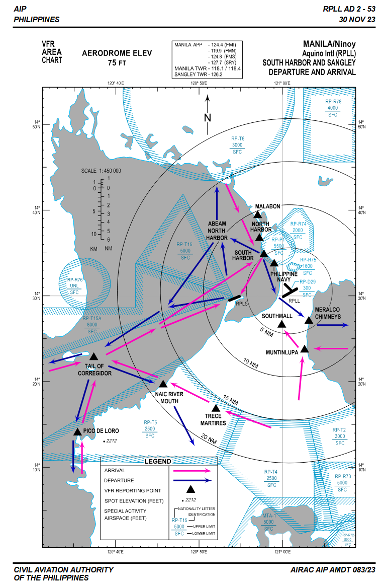

# Visual Flight Rules (VFR) Within Manila TMA

1. All VFR aircraft must be able to tune to frequencies in the VATSIM network, including, but not limited to:
    1. 121.800 MHz (RPLL_GND)
    2. 118.100 MHz (RPLL_TWR)
    3. 124.400 MHz (RPLL_F_APP)
    4. 124.800 MHz (RPLL_APP)
    5. 119.300 MHz (MNL_CTR)

2. Prior entering designated VFR areas, contact RPLL_TWR on 118.100 MHz
3. Adhere to established Manila VFR arrival/departure routings
4. Maintain not above 1500 FT within 10 NM from RPLL, not above 2500 FT within 10 - 15 NM from RPLL
5. When intending to transit the IFR climb/descend areas, contact Manila Approach on 124.400 (RPLL_F_APP), 124.800 MHz (RPLL_APP) or 119.300 MHz (MNL_CTR) for the necessary clearance.
6. All VFR aircraft inside the Manila Control Zone (CTR) must maintain listening watch with RPLL_TWR or higher controller up to the exit points
7. All VFR aircraft outside the Manila CTR but inside Manila TMA must maintain listening watch with RPLL_F_APP or higher controller
8. All arriving VFR flights shall initiate contact and remain on listening watch thereafter with RPLL_TWR upon entering Manila CTR
9. Any deviation from departure / arrival procedures shall have prior approval from RPLL_TWR or higher controller
10. All runway threshold or approach path crossing shall have explicit clearance from RPLL_TWR or higher controller.

## VFR Departure Flights

### VFR Area Chart FIXED WING

### Northbound aircraft FIXED WING

1. **Runway 06/13**
{ align=left }
    Runway 13: Climb straight ahead. After passing runway intersection make a right climbing turn to join downwind RWY 06.
    
    Runway 06: Join downwind RWY 06
    
    Obtain clearance from Manila Control Tower before crossing final approach of RWY 06. 
    
    Climb to 1500 FT after crossing final approach of RWY 06. 
    
    Execute a left turn abeam threshold of RWY 13  to fly West of SOUTH HARBOR. (refer to chart above)
    
    Report abeam MALABON (refer to chart above) then proceed to destination.
    
    

2. **Runway 31**

    Make a left turn after take-off to fly West of SOUTH HARBOR (refer to chart above), continue
    climb to 1500 FT.
         
    Report abeam MALABON (refer to chart above) then proceed to destination.

    

3. **Runway 24**
    
    Climb straight ahead. Make a right turn at the end of the runway.
    
    Climb to 1500 FT
    
    Execute a left turn abeam threshold of RWY 13  to fly West of SOUTH HARBOR. (refer to chart above)
    
    Report abeam MALABON (refer to chart above) then proceed to destination.

    

### Westbound aircraft FIXED WING

1. **Runway 06/13**

    Runway 13: Climb straight ahead. After passing runway intersection make a right climbing turn to join downwind RWY 06.
    
    Runway 06: Join downwind RWY 06
    
    Obtain clearance from RPLL_TWR before crossing final approach of RWY 06. 
    
    Climb to 1500 FT after crossing final approach of RWY 06. 
    
    Execute a left turn abeam threshold of RWY 13  to fly abeam of NORTH HARBOR. (refer to chart above)

    Follow next instructions of ATC    
    
    

2. **Runway 31**

    Make a left turn after take-off to fly West of SOUTH HARBOR (refer to chart above), continue
    climb to 1500 FT.
         
    Follow next instructions of ATC   

    

3. **Runway 24**
    
    Climb straight ahead. Make a right turn at the end of the runway.
    
    Climb to 1500 FT
    
    Execute a left turn abeam threshold of RWY 13  to fly abeam NORTH HARBOR. (refer to chart above)

    Follow next instructions of ATC   

    

### Southbound / Eastbound aircraft FIXED WING

1. **Runway 06/13/24**

    Runway 13: Make a straight-out departure climbing to 1500 FT towards the East side of the MERALCO CHIMNEYS.
    
    Runway 06: Climb straight ahead to 1500 FT and execute a right turn towards the East side of the MERALCO CHIMNEYS
    
    Runway 24: Climb straight ahead to 1500 FT and execute a left turn towards the East side of the MERALCO CHIMNEY 

    Follow next instructions of ATC
    

2. **Runway 31**
    Climb straight ahead and execute a left climbing turn    

    Obtain clearance from RPLL_TWR before crossing over the threshold/final approach path of RWY 06.

    Fly straight ahead climbing to 1500 FT towards the East Side of the MERALCO CHIMNEYS

    

## VFR Arrival Flights

### From the North

1. Report to RPLL_TWR approaching MALABON
2. 
    1. Runway 13: Request straight-in approach before SOUTH HARBOR
        1. WHEN APPROVED, report PHILIPPINE NAVY
        2. When disapproved, join downwind RWY 13 or as instructed by ATC
    2. Runway 06/24: Subject to ATC instructions

### From the South/East
1. Report to RPLL_TWR approaching MUNTINLUPA
2. Report over SOUTHMALL
3. 
    1. Runway 13: request for clearance to cross over threshold/final approach path of RWY 06 prior to entering downwind at traffic pattern altitude.
    2. Runway 06/24: Subject to ATC instructions

### From the West
1. Report to RPLL_APP/RPLL_F_APP approaching CORREGIDOR at or below 2500 FT.
2. Continue towards abeam Sangley not above 1500 FT within 10 NM RPLL, contact RPLL_TWR for further instructions