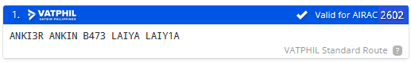

# RPMD - Francisco Bangoy International Airport

## General
The Francisco Bangoy International Airport (also known as Davao International Airport) has 1 Runway, 1 passenger terminals, 1 general aviation area, 1 military station, and 1 military hangar.

- Main Terminal - Domestic and International Passenger and Cargo Flights 

The airport caters passenger and cargo flights, as well as general and military aviation.

## Charts
[RPMD](https://vatphil.com/charts?icao=RPMD){ .md-button .md-button--primary }

## Frequency List
<table>
  <thead>
    <tr>
      <th style="text-align:center">Designator</th>
      <th style="text-align:center">Callsign</th>
      <th style="text-align:center">Frequency</th>
      <th style="text-align:center">Remarks</th>
    </tr>
  </thead>
  <tbody>
    <tr>
      <td style="text-align:center"><strong>RPMD_ATIS</strong></td>
      <td style="text-align:center"></td>
      <td style="text-align:center">127.000</td>
      <td style="text-align:center">Every hour</td>
    </tr>
    <tr>
      <td style="text-align:center"><strong>RPMD_TWR</strong></td>
      <td style="text-align:center">Davao Tower</td>
      <td style="text-align:center">118.100</td>
      <td style="text-align:center"></td>
    </tr>
    <tr>
      <td style="text-align:center"><strong>RPMD_APP</strong></td>
      <td style="text-align:center">Davao Approach[^2]</td>
      <td style="text-align:center">122.400</td>
      <td style="text-align:center">TMA 1500 ft - FL150[^1]</td>
    </tr>
    <tr>
      <td style="text-align:center"><strong>RPMD_R_APP</strong></td>
      <td style="text-align:center">Davao Radio</td>
      <td style="text-align:center">124.000</td>
      <td style="text-align:center">SUB TMA 1500 ft - FL150[^1]</td>
    </tr>
  </tbody>
</table>

## Runways

Davao currently has 1 runway.
Below is a table of the Take-Off Run available

**Take-off Run Available.**

<table>
  <thead>
    <tr>
      <th style="text-align:center">Runway</th>
      <th style="text-align:center">TORA ft (m)</th>
    </tr>
  </thead>
  <tbody>
    <tr>
      <td style="text-align:center"><strong>05</strong></td>
      <td style="text-align:center">9,839 (2999)</td>
    </tr>
    <tr>
      <td style="text-align:center"><strong>23</strong></td>
      <td style="text-align:center">9,839(2999)</td>
    </tr>

  </tbody>
</table>

## Routes

Local flights within RPHI and some international flights are to use routes given below. Simbrief also give a standard route which looks like this

If your route is still invalid, a controller will send you a private message with your new route. Routes within RPHI are to follow the half-moon principle in both RVSM and non-RVSM conditions. During events you will have 5 minutes between the time you request clearance and the time you request pushback, or you will have to wait until a new slot is available.

!!! warning

    During events it is important that you put your EOBT in your flight plan as controllers will use that to determine your takeoff slot.

## Waypoint Restrictions

<h3 style="text-align:center"><strong>Waypoint Restrictions</strong></h3>

<table>
  <thead>
    <tr>
      <th style="text-align:center">FIR</th>
      <th style="text-align:center">Waypoint</th>
      <th style="text-align:center">Airway</th>
      <th style="text-align:center">Altitude (FL)</th>
    </tr>
  </thead>
  <tbody>
    <tr>
      <td style="text-align:center"><strong>HONG KONG</strong></td>
      <td style="text-align:center"><strong>NOMAN / SABNO</strong></td>
      <td style="text-align:center"><strong>A583 / A461 / M501</strong></td>
      <td style="text-align:center"><strong>300 / 340 / 380</strong></td>
    </tr>
    <tr>
      <td rowspan="4" style="text-align:center"><strong>SINGAPORE</strong></td>
      <td style="text-align:center"><strong>TEGID</strong></td>
      <td style="text-align:center"><strong>M767</strong></td>
      <td style="text-align:center"><strong>310 / 320 / 350 / 360 / 390 / 400</strong></td>
    </tr>
    <tr>
      <td rowspan="3" style="text-align:center"><strong>LAXOR</strong></td>
      <td style="text-align:center"><strong>L649</strong></td>
      <td style="text-align:center"><strong>300 / 380</strong></td>
    </tr>
    <tr>
      <td style="text-align:center"><strong>M772</strong></td>
      <td style="text-align:center"><strong>300 / 380</strong></td>
    </tr>
    <tr>
      <td style="text-align:center"><strong>N884</strong></td>
      <td style="text-align:center"><strong>320 / 360 / 400</strong></td>
    </tr>
    <tr>
      <td rowspan="3" style="text-align:center"><strong>HO CHI MINH</strong></td>
      <td rowspan="2" style="text-align:center"><strong>PANDI / ARESI</strong></td>
      <td style="text-align:center"><strong>M765 / L628</strong></td>
      <td style="text-align:center"><strong>280 / 340</strong></td>
    </tr>
    <tr>
      <td style="text-align:center"><strong>N500</strong></td>
      <td style="text-align:center"><strong>300</strong></td>
    </tr>
    <tr>
      <td style="text-align:center"><strong>MIGUG</strong></td>
      <td style="text-align:center"><strong>N892</strong></td>
      <td style="text-align:center"><strong>310 / 320 / 350 / 360 / 390 / 400</strong></td>
    </tr>
  </tbody>
</table>

## Clearance

On first contact with the controller that will issue your clearance, it is recommended for you to give
the following information:

- Your bay number
- Your aircraft type
- The ATIS information letter

!!! warning

    Radio Checks on first contact are **discouraged** when building communication with the controller. 
    It's best to greet or ask the controller, should you need any help before clearance issuance.

    Be straightforward and concise as possible when communicating within a controlled frequency. 

Once you have requested for clearance, the controller will either tell you to standby, or give your clearance on the spot. Clearances include your routing, flight level restrictions, departure instructions and your squawk.

You must read back the clearance in full. Listen carefully to all details that the controller gives you, and if you are unsure about your clearance, **let the controller know.**

??? phraseology

    **PAL1810**: Davao Tower, PAL1810, Stand 4, A-3-2-1 with information A, request clearance Manila.

    **RPMD_TWR**: PAL1810, cleared Manila, B473 LAIYA, RUNWAY 005 ANKIN3R, Climb FL150, Squawk 4024

## Pushback

Normally, a controller in Davao will instruct you to push back to the nearest start-up point. Other times, they will push you to a reference point.\

For RWY 05 departures, expect Start-up points S1 or S2

For RWY 23 departures, expect Start-up points S2 or S3

!!! warning 

    1. **Do not preplan your pushback!**
    2. Connect the tug first!

??? phraseology "Phraseology"	

    **PAL1810**: Davao Tower, PAL1810, Stand 4, request push and start, runway 05.

    **RPMD_TWR**: PAL1810, push and start approved, abeam stand 5, face A3

## Departure

The departure procedure is decided by an online Approach (**APP**) or En-route Controller (**CTR**). When both are offline, Standard Instrument Departures (**SIDs**) are given by the aerodrome controllers (**TWR**, **GND** or **DEL**). When either **APP** or **CTR** is online, they decide if departures will be given radar vectors (climb and heading instructions) to the TMA exit points or will be following a **SID**.

When **APP** or **CTR** is online, after passing 2000 feet or 5 DME from RPMD, report your passing altitude to **APP**  or **CTR**. This is to help them identify you successfully in their radar screens.

??? phraseology "Phraseology"

    **PAL1810**: Davao Approach, PAL1810, passing 2000, climbing FL150, ANKIN3R

    **RPMD_APP**: PAL1810, radar identified, continue climb FL150

## Arrival

When arriving in to Davao, it is best for you to be in between 10,000 FT and FL130 when reaching the border of the TMA or the start of the STAR. On initial contact with Davao Approach (RPMD_APP), report your current level.

??? phraseology "Phraseology"

    **PAL1809**: Davao Approach, PAL1809, FL130, inbound RIMAR

APP will then issue your arrival clearance including the type of approach to expect to the active runway. APP either gives you radar vectors to final or gives you descent clearances via a STAR.

??? phraseology "Phraseology"

    **RPMD_APP**: PAL1809, radar contact, cleared Davao expect radar vectors ILS 05

    **PAL1809**: Cleared Davao expect radar vectors ILS 05, PAL1809

    **RPMD_APP**: PAL1809, Maintain present heading, descend 10,000, QNH 1011

    **PAL1809**: Maintain present heading, descend 10,000, QNH 1011, PAL1809

!!! warning

    If APP didn’t give you any turns after you have passed the last waypoint on your routing, maintain your present heading.

## Taxi Routing

Unless otherwise instructed by ATC, all aircraft landing RWY 05 shall taxi-in via taxiway A4. Aircraft landing RWY 23 shall taxi-in via taxiway A3

[^1]: Vertical limit of FL150 can be increased to a maximum of FL200.

*[GA]: General Aviation
*[EOBT]: Estimated off block time
*[TOBT]: Target off block time
*[TSAT]: Target start approval time
*[ASRT]: Actual start up time
*[TTOT]: Target takeoff time
*[CTOT]: Calculated takeoff time
*[RPMD_DEL]: Clearance Delivery
*[RPMD_TWR]: Davao Tower
*[RPMD_APP]: Davao Approach
*[RPMD_R_APP]: Davao Radio
