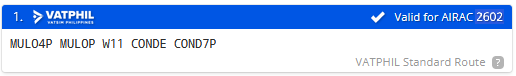

## RPVM - Mactan - Cebu International Airport

# General
The Ninoy Aquino International Airport has 2 Runways, 2 passenger terminals, 1 general aviation areas, 1 military airbase, and 1 military maintenance hangar.

- Terminal 1 - Domestic Passenger and Cargo Flights 
- Terminal 2 - International Passenger and Cargo Flights

The airport caters passenger and cargo flights, as well as general and military aviation.

# Charts
[RPVM](https://vatphil.com/charts?icao=RPVM){ .md-button .md-button--primary }

# Stand Assignments

Bay assignments, are strictly implemented virtually, and are based on the latest
real-world operations. Virtual and other real-world airlines that are not listed will park at terminal 2.

TBD

# Runways

Mactan currently has 2 runways .
Below is a table of the Take-Off Run available

**Take-off Run Available.**

<table>
  <thead>
    <tr>
      <th style="text-align:center">Runway</th>
      <th style="text-align:center">Intersection</th>
      <th style="text-align:center">TORA ft (m)</th>
    </tr>
  </thead>
  <tbody>
    <tr>
      <td rowspan="2" style="text-align:center"><strong>04R</strong></td>
      <td style="text-align:center">A4</td>
      <td style="text-align:center">5,561 (1695)</td>
    </tr>
    <tr>
      <td style="text-align:center">A5</td>
      <td style="text-align:center">8,301 (2530)</td>
    </tr>
    <tr>
      <td rowspan="2" style="text-align:center"><strong>22L</strong></td>
      <td style="text-align:center">A2</td>
      <td style="text-align:center">9,121 (2780)</td>
    </tr>
    <tr>
      <td style="text-align:center">A3</td>
      <td style="text-align:center">7,841 (2390)</td>
    </tr>
    <tr>
      <td rowspan="2" style="text-align:center"><strong>04L</strong></td>
      <td style="text-align:center">B5</td>
      <td style="text-align:center">5,233 (1595)</td>
    </tr>
    <tr>
      <td style="text-align:center">B6</td>
      <td style="text-align:center">6,939 (2115)</td>
    </tr>
    <tr>
      <td rowspan="2" style="text-align:center"><strong>22R</strong></td>
      <td style="text-align:center">B3</td>
      <td style="text-align:center">6,955 (2120)</td>
    </tr>
    <tr>
      <td style="text-align:center">B4</td>
      <td style="text-align:center">5,705 (1739)</td>
    </tr>
  </tbody>
</table>

!!! warning

    Runways 04L and 04R are not used at the same time

# Frequency List
<table>
  <thead>
    <tr>
      <th style="text-align:center">Designator</th>
      <th style="text-align:center">Callsign</th>
      <th style="text-align:center">Frequency</th>
      <th style="text-align:center">Remarks</th>
    </tr>
  </thead>
  <tbody>
    <tr>
      <td style="text-align:center"><strong>RPLL_ATIS</strong></td>
      <td style="text-align:center"></td>
      <td style="text-align:center">126.400</td>
      <td style="text-align:center">Every hour</td>
    </tr>
    <tr>
      <td style="text-align:center"><strong>RPVM_DEL</strong></td>
      <td style="text-align:center">Clearance Delivery</td>
      <td style="text-align:center">126.600</td>
      <td style="text-align:center"></td>
    </tr>
    <tr>
      <td style="text-align:center"><strong>RPVM_GND</strong></td>
      <td style="text-align:center">Mactan Ground</td>
      <td style="text-align:center">121.800</td>
      <td style="text-align:center"></td>
    </tr>
    <tr>
      <td style="text-align:center"><strong>RPVM_TWR</strong></td>
      <td style="text-align:center">Mactan Tower</td>
      <td style="text-align:center">118.100</td>
      <td style="text-align:center"></td>
    </tr>
    <tr>
      <td style="text-align:center"><strong>RPVM_APP</strong></td>
      <td rowspan="3" style="text-align:center">Mactan Approach[2]</td>
      <td style="text-align:center">124.700</td>
      <td style="text-align:center">TMA 1500 ft - FL150[1]</td>
    </tr>
    <tr>
      <td style="text-align:center"><strong>RPVM_S_APP</strong></td>
      <td style="text-align:center">121.200</td>
      <td style="text-align:center">SUB TMA 1500 ft - FL150[1]</td>
    </tr>
  </tbody>
  
</table>

1 Vertical limit of FL150 can be increased to a maximum of FL200.  
2 Can control top-down Mactan TMA which includes RPVD and RPSP. But check the controller information if they do!

# Routes

Local flights within RPHI and some international flights are to use routes given below. Simbrief also give a standard route which looks like this

If your route is still invalid, a controller will send you a private message with your new route. Routes within RPHI are to follow the half-moon principle in both RVSM and non-RVSM conditions. During events you will have 5 minutes between the time you request clearance and the time you request pushback, or you will have to wait until a new slot is available.

!!! warning

    During events it is important that you put your EOBT in your flight plan as 
    controllers will use that to determine your takeoff slot.

# Waypoint Restrictions

<h3 style="text-align:center"><strong>Waypoint Restrictions</strong></h3>

<table>
  <thead>
    <tr>
      <th style="text-align:center">FIR</th>
      <th style="text-align:center">Waypoint</th>
      <th style="text-align:center">Airway</th>
      <th style="text-align:center">Altitude (FL)</th>
    </tr>
  </thead>
  <tbody>
    <tr>
      <td style="text-align:center"><strong>HONG KONG</strong></td>
      <td style="text-align:center"><strong>NOMAN / SABNO</strong></td>
      <td style="text-align:center"><strong>A583 / A461 / M501</strong></td>
      <td style="text-align:center"><strong>300 / 340 / 380</strong></td>
    </tr>
    <tr>
      <td rowspan="4" style="text-align:center"><strong>SINGAPORE</strong></td>
      <td style="text-align:center"><strong>TEGID</strong></td>
      <td style="text-align:center"><strong>M767</strong></td>
      <td style="text-align:center"><strong>310 / 320 / 350 / 360 / 390 / 400</strong></td>
    </tr>
    <tr>
      <td rowspan="3" style="text-align:center"><strong>LAXOR</strong></td>
      <td style="text-align:center"><strong>L649</strong></td>
      <td style="text-align:center"><strong>300 / 380</strong></td>
    </tr>
    <tr>
      <td style="text-align:center"><strong>M772</strong></td>
      <td style="text-align:center"><strong>300 / 380</strong></td>
    </tr>
    <tr>
      <td style="text-align:center"><strong>N884</strong></td>
      <td style="text-align:center"><strong>320 / 360 / 400</strong></td>
    </tr>
    <tr>
      <td rowspan="3" style="text-align:center"><strong>HO CHI MINH</strong></td>
      <td rowspan="2" style="text-align:center"><strong>PANDI / ARESI</strong></td>
      <td style="text-align:center"><strong>M765 / L628</strong></td>
      <td style="text-align:center"><strong>280 / 340</strong></td>
    </tr>
    <tr>
      <td style="text-align:center"><strong>N500</strong></td>
      <td style="text-align:center"><strong>300</strong></td>
    </tr>
    <tr>
      <td style="text-align:center"><strong>MIGUG</strong></td>
      <td style="text-align:center"><strong>N892</strong></td>
      <td style="text-align:center"><strong>310 / 320 / 350 / 360 / 390 / 400</strong></td>
    </tr>
  </tbody>
</table>

# Clearance

On first contact with the controller that will issue your clearance, it is recommended for you to give
the following information:

- Your bay number
- Your aircraft type
- The ATIS information letter

??? phraseology "Phraseology"

    **PAL1862**:“Clearance Delivery, PAL1862, stand B3, A-3-2-1, with Information Alpha, request clearance Manila runway 04R”

!!! warning

    Radio Checks on first contact are **discouraged** when building communication with the controller. 
    It's best to greet or ask the controller, should you need any help before clearance issuance.

    Be straightforward and concise as possible when communicating within a controlled frequency. 

Once you have requested for clearance, the controller will either tell you to standby, or give your clearance on the spot. Clearances include your routing, flight level restrictions, departure instructions and your squawk.

You must read back the clearance in full. Listen carefully to all details that the controller gives you, and if you are unsure about your clearance, **let the controller know.**

??? phraseology

    **CEB586**: Clearance Delivery, CEB586, Stand B2, A-3-2-0 with information A, request clearance Manila, runway 04R.

    **RPVM_DEL**: CEB586, cleared Manila, W11 CONDE, RUNWAY 04R MULOP4P, Climb  FL150, Squawk 4024

# Pushback

Normally, a controller in Mactan will instruct you to push back to the nearest reference point.

!!! warning 

    1. **Do not preplan your pushback!**
    2. Connect the tug first!

??? phraseology "Phraseology"	

    **CEB586**: Mactan Ground, CEB586, Stand B2, request push and start, runway 04R.

    **RPVM_GND**: CEB585, push and start approved, abeam B3, face D2

# Departure

The departure procedure is decided by an online Approach (**APP**) or En-route Controller (**CTR**). When both are offline, Standard Instrument Departures (**SIDs**) are given by the aerodrome controllers (**TWR**, **GND** or **DEL**). When either **APP** or **CTR** is online, they decide if departures will be given radar vectors (climb and heading instructions) to the TMA exit points or will be following a **SID**.

When **APP** or **CTR** is online, after passing 2000 feet or 5 DME from RPVM, report your passing altitude to **APP**  or **CTR**. This is to help them identify you successfully in their radar screens.

??? phraseology "Phraseology"

    **CEB586**: “Mactan Approach, CEB586, passing 2000, climbing FL150, MULOP4P”

    **RPVM_APP**: “CEB586, radar identified, continue climb FL150”

# Arrival

When arriving in to Mactan, it is best for you to be in between FL160 and FL180 when reaching the border of the TMA or the start of the STAR. On initial contact with Mactan Approach (RPVM_APP), report your current level.

??? phraseology "Phraseology"

    **CEB585**: “Mactan Approach, CEB585, passing FL170, inbound BATAY”

APP will then issue your arrival clearance including the type of approach to expect to the active runway. APP either gives you radar vectors to final or gives you descent clearances via a STAR.

??? phraseology "Phraseology"

    **RPVM_APP**: “CEB585, radar contact, cleared Mactan, BATAY3P expect RNP04R”

    **CEB585**: “Cleared Mactan, BATAY3P, expect RNP04R, CEB585”

    **RPVM_APP**: “CEB585, descend via STAR 4000, Mactan QNH 1009”

    **CEB585**: “descend via STAR 4000, Mactan QNH 1009, CEB585”

!!! warning

    If APP didn’t give you any turns after you have passed the last waypoint on your routing, maintain your present heading.

# Aircraft Taxiing Route

1. When RWY 04R in use:
    1. Departures shall taxi from parking aprons via TWY D1 or TWY D2 or TWY D3 then TWY C to TWY B7 to TWY A5 for short field take-off; or continue TWY A6 for normal take-off.
    2. Arrivals shall taxi via Rapid Exit TWY R1 or TWY A3 to TWY B4 or via TWY A2 to TWY B3 to the parking apron; or via TWY A1 to TWY B2 to TWY C then TWY D1 to the parking apron.
    3. General Aviation aircraft departures shall taxi from the parking apron via TWY G2.
    4.  General Aviation aircraft arrivals shall taxi to the parking apron via TWY G1.

2. When RWY 22L in use:

    1. Departures shall taxi from parking aprons via TWY D1 or TWY D2 or TWY D3 to TWY C to TWY B3 to TWY A2 for short field take-off; or continue TWY C to TWY B2 to TWY A1 for normal take-off.
    2. Arrivals shall taxi via Rapid Exit TWY R2 to TWY B6 or TWY A5 to TWY B7 or TWY A6 to TWY C then TWY D1 or TWY D2 or TWY D3 to the parking apron.
    3. General Aviation aircraft departures shall taxi from the parking apron via TWY G1 or TWY G2.
    4. General Aviation aircraft arrivals shall taxi to the parking apron via TWY G1 or TWY G2.

3.  When RWY 04L in use:
    1. Departures shall taxi from parking aprons via TWY D1 or TWY D2 or TWY D3 then TWY C to TWY B7 or TWY B6.
    2. Arrivals shall taxi via TWY B2 to the parking apron; or via TWY B3 to TWY C then TWY D1 or TWY D2 or TWY D3 
    3. General Aviation aircraft departures shall taxi from the parking apron via TWY G1 or TWY G2.
    4. General Aviation aircraft arrivals shall taxi to the parking apron via TWY G1 or TWY G2. 

4. When RWY 22R in use:
    1. Departures shall taxi from parking aprons via TWY D1 or TWY D2 or TWY D3 then TWY C to TWY B2.
    2. Arrivals shall taxi via TWY B7 or TWY B6 to TWY C then TWY D1 or TWY D2 or TWY D3 to the parking apron.
    3. General Aviation aircraft departures shall taxi from the parking apron via TWY G1 to TWY A4.
    4. General Aviation aircraft arrivals shall taxi to the parking apron via TWY A5 to TWY G2.

*[EOBT]: Estimated off block time
*[TOBT]: Target off block time
*[TSAT]: Target start approval time
*[ASRT]: Actual start up time
*[TTOT]: Target takeoff time
*[CTOT]: Calculated takeoff time
*[RPVM_DEL]: Clearance Delivery
*[RPVM_GND]: Mactan Ground
*[RPVM_TWR]: Mactan Tower
*[RPVM_APP]: Mactan Approach
*[RPVM_S_APP]: Mactan Approach
