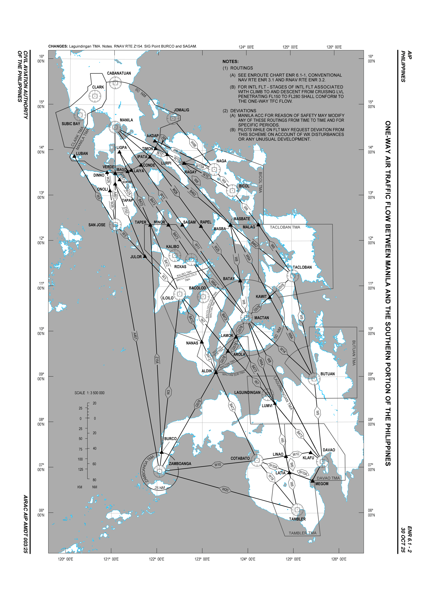
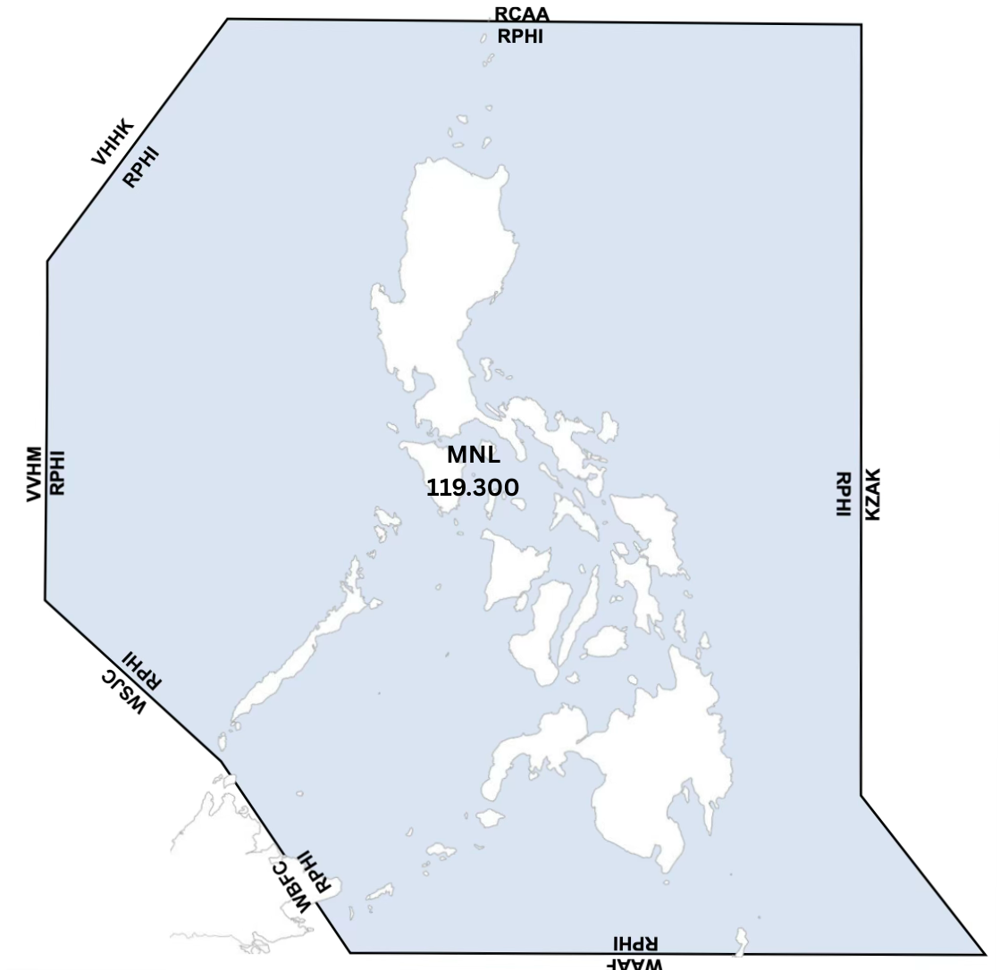
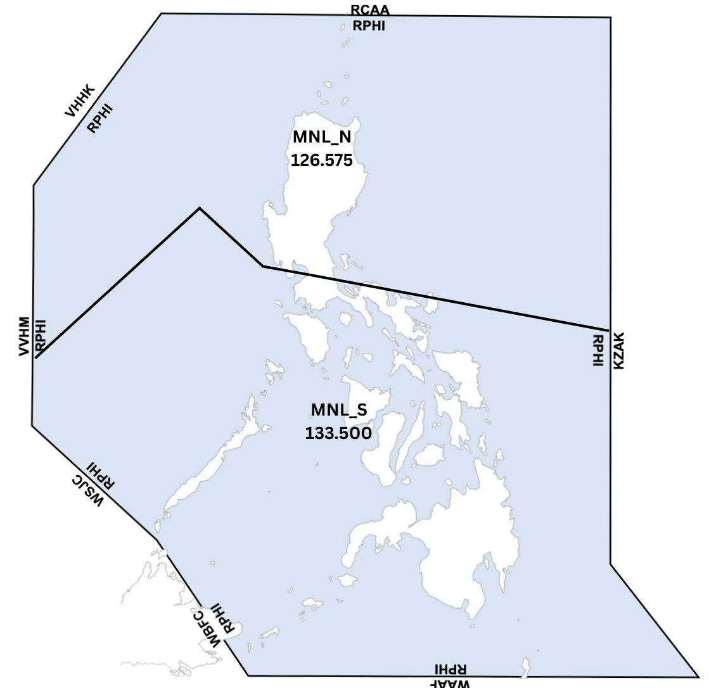
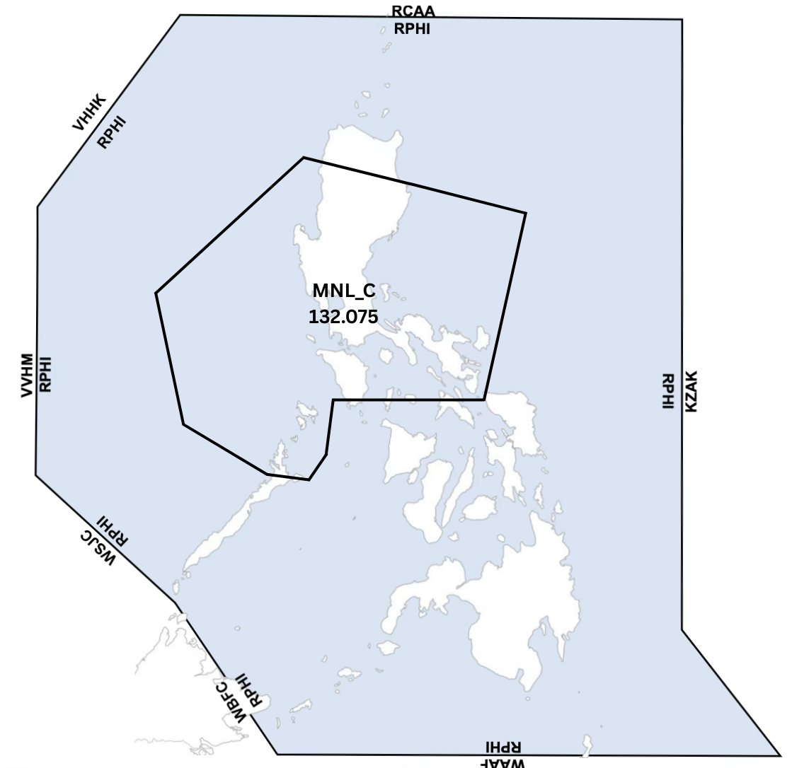
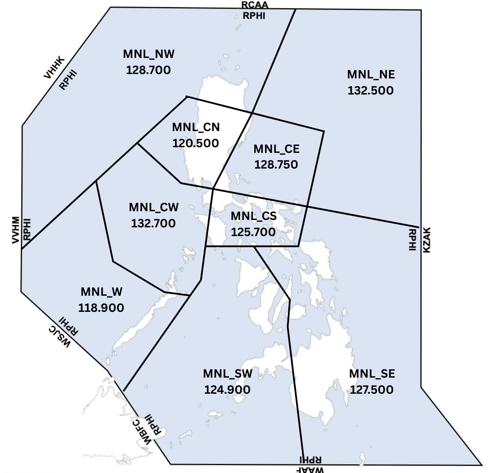
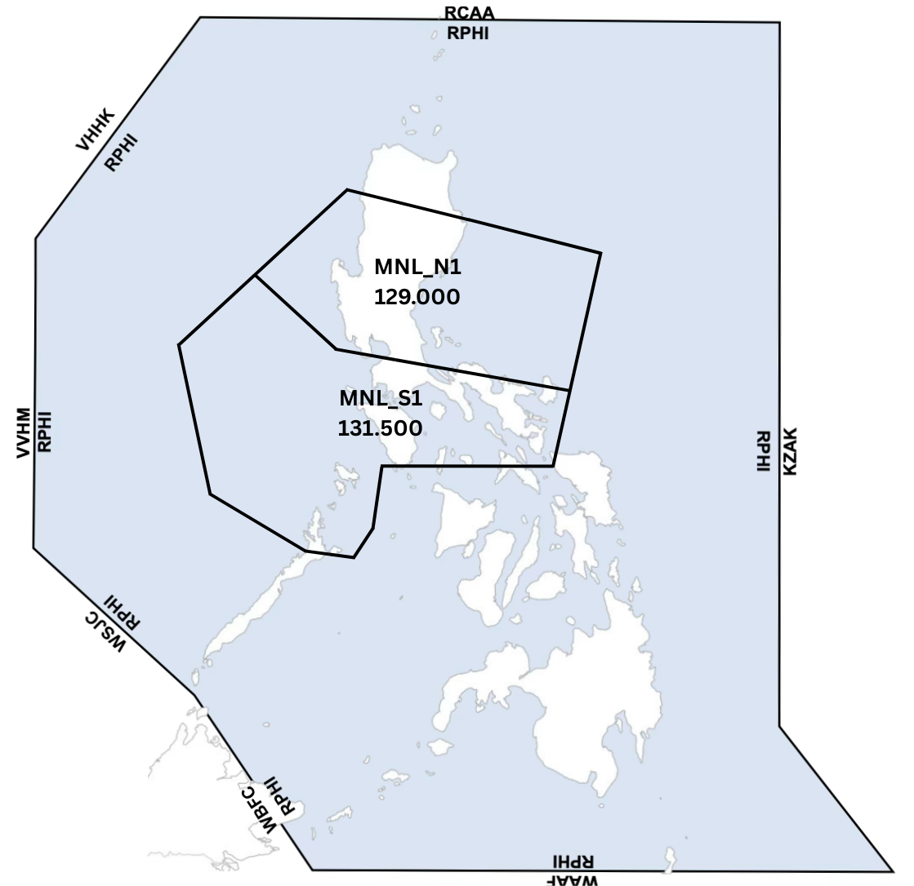
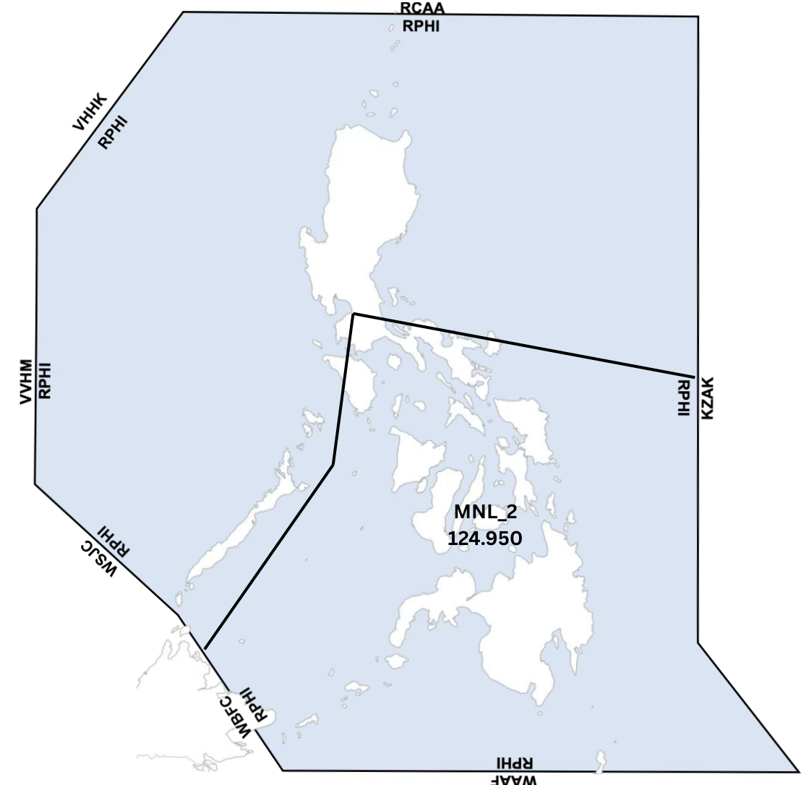

# Briefings
Here you will find aerodrome briefings for the airports within the Philippines! To start select an Aerodrome below.

[RPLL](https://learn.vatphil.com/briefings/RPLL/){ .md-button .md-button--primary }

[RPVM](https://learn.vatphil.com/briefings/RPVM/){ .md-button .md-button--primary }

[RPMD](https://learn.vatphil.com/briefings/RPMD/){ .md-button .md-button--primary }

[RPHI](https://learn.vatphil.com/briefings/RPHI/){ .md-button .md-button--primary }

## RPHI Briefing

<figure markdown="span">
  { width="800" }
  <figcaption>RNAV Routes Within RPHI</figcaption>
</figure>

## Frequencies

| Callsign | Frequency |
|---|---|
| MNL_CTR | 119.300 |
| MNL_C_CTR | 132.075 |
| MNL_N_CTR | 126.575 |
| MNL_S_CTR | 133.500 |
| MNL_2_CTR | 124.950 |
| MNL_N1_CTR | 129.000 |
| MNL_S1_CTR | 131.500 |
| MNL_NW_CTR | 128.700 |
| MNL_NE_CTR | 132.500 |
| MNL_CN_CTR | 120.500 |
| MNL_CE_CTR | 128.750 |
| MNL_CS_CTR | 125.700 |
| MNL_CW_CTR | 132.700 |
| MNL_W_CTR | 118.900 |
| MNL_SW_CTR | 124.900 |
| MNL_SE_CTR | 125.750 |

## Manila ACC

## North ACC Combined and South ACC Combined

##  North and South Central ACC Combined

## ACC Split Sectors

## Central ACC Combined

## Manila ACC South Combined

## Phraseology

### Manila Radio

Currently the only radio that can be implemented by Manila Control is MNL_NE_CTR, otherwise known as Manila Oceanic. Under Manila Radio, you can still expect [[RVSM](rvsm.md).](https://learn.vatphil.com/classroom/rvsm/).

When contacting Manila Radio, keep in mind that they will not be able to see you and are purely going off what you give them. It is important to have atleast these four information at hand.

1. Aircraft identification.
2. Position and time
3. Level.
4. Next position and ETA.

!!! phraseology "Phraseology"

    Manila Radio, PAL123, Over BISIG 1300z, FL320, Next EXOMI at 1330z

*[MNL_NE_CTR]: Manila Radio or Manila Control