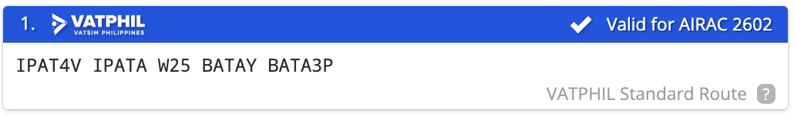
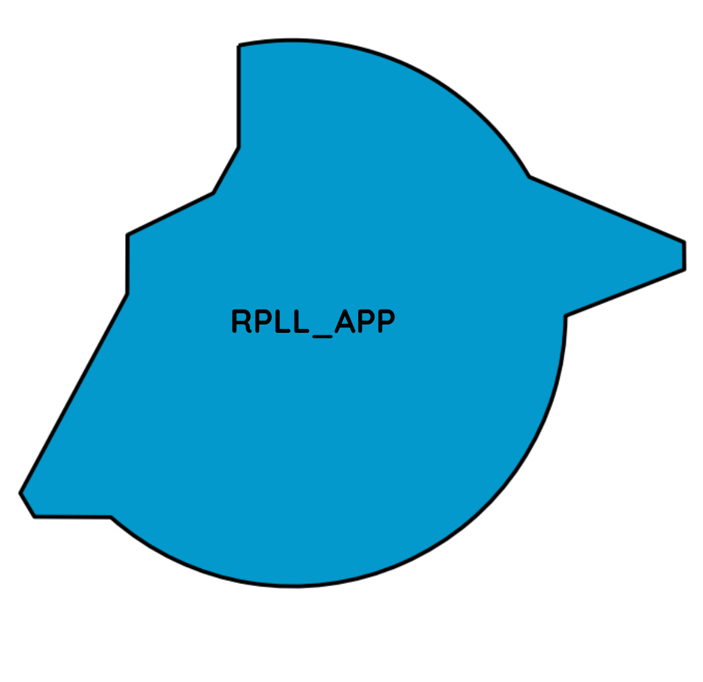
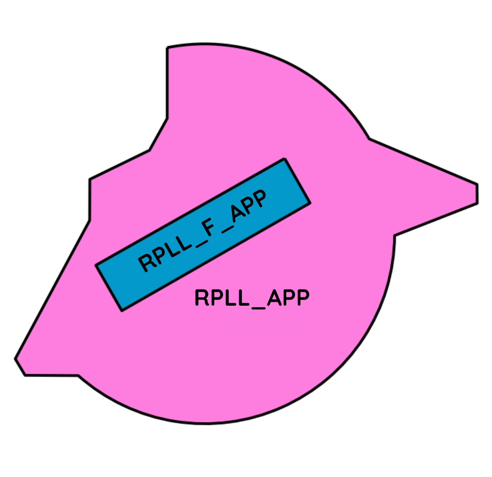
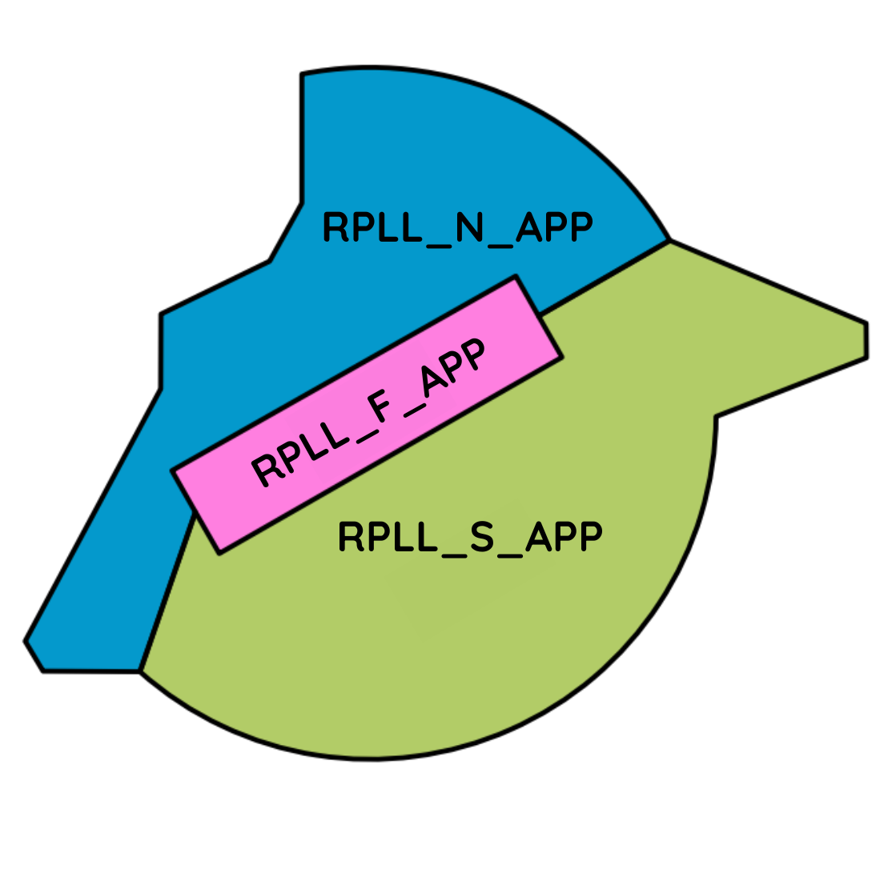

# RPLL - Manila - Ninoy Aquino International Airport

Fetching METAR...

## General
The Ninoy Aquino International Airport has 2 Runways, 4 passenger terminals, 2 general aviation areas, 1 military airbase, 1 maintenance hangar, and 1 presidential ramp.

- Terminal 1 - International and Cargo Terminal
- Terminal 2 - Domestic Flights
- Terminal 3 - International and Domestic Flights
- Terminal 4/5 - Currently under construction

The airport caters passenger and cargo flights, as well as general and military aviation.

## Charts
<iframe
  data-chart-src="https://vatphil.com/charts?icao=RPLL"
  title="RPLL Charts"
  loading="lazy"
  style="width:100%; height:750px; border:1px solid var(--md-default-fg-color--lightest); border-radius:8px;">
</iframe>

[Open charts in new tab](https://vatphil.com/charts?icao=RPLL){ .md-button .md-button--primary }

## Frequency List
<table>
  <thead>
    <tr>
      <th style="text-align:center">Designator</th>
      <th style="text-align:center">Callsign</th>
      <th style="text-align:center">Frequency</th>
      <th style="text-align:center">Remarks</th>
    </tr>
  </thead>
  <tbody>
    <tr>
      <td style="text-align:center"><strong>RPLL_ATIS</strong></td>
      <td style="text-align:center"></td>
      <td style="text-align:center">126.400</td>
      <td style="text-align:center">Every hour</td>
    </tr>
    <tr>
      <td style="text-align:center"><strong>RPLL_DEL</strong></td>
      <td style="text-align:center">Clearance Delivery</td>
      <td style="text-align:center">125.100</td>
      <td style="text-align:center">DCL [RPLL]</td>
    </tr>
        <tr>
      <td style="text-align:center"><strong>RPLL_P_GND</strong></td>
      <td style="text-align:center">Manila Planner</td>
      <td style="text-align:center">122.000</td>
      <td style="text-align:center">Event's only</td>
    </tr>
    <tr>
      <td style="text-align:center"><strong>RPLL_1_RMP</strong></td>
      <td style="text-align:center">Apron Control One</td>
      <td style="text-align:center">121.700</td>
      <td style="text-align:center">Terminal 1</td>
    </tr>
    <tr>
      <td style="text-align:center"><strong>RPLL_2_RMP</strong></td>
      <td style="text-align:center">Apron Control Two</td>
      <td style="text-align:center">128.800</td>
      <td style="text-align:center">Terminal 2</td>
    </tr>
    <tr>
      <td style="text-align:center"><strong>RPLL_3_RMP</strong></td>
      <td style="text-align:center">Apron Control Three</td>
      <td style="text-align:center">121.350</td>
      <td style="text-align:center">Terminal 3</td>
    </tr>
    <tr>
      <td style="text-align:center"><strong>RPLL_G_RMP</strong></td>
      <td style="text-align:center">Apron Control GenAv</td>
      <td style="text-align:center">123.250</td>
      <td style="text-align:center">GenAv</td>
    </tr>
    <tr>
      <td style="text-align:center"><strong>RPLL_GND</strong></td>
      <td style="text-align:center">Manila Ground</td>
      <td style="text-align:center">121.800</td>
      <td style="text-align:center"></td>
    </tr>
    <tr>
      <td style="text-align:center"><strong>RPLL_TWR</strong></td>
      <td style="text-align:center">Manila Tower</td>
      <td style="text-align:center">118.100</td>
      <td style="text-align:center"></td>
    </tr>
    <tr>
      <td style="text-align:center"><strong>RPLL_F_APP</strong></td>
      <td style="text-align:center">Manila Finals/Departure</td>
      <td style="text-align:center">124.400</td>
      <td style="text-align:center">1500ft - FL150</td>
    </tr>
    <tr>
      <td style="text-align:center"><strong>RPLL_S_APP</strong></td>
      <td rowspan="3" style="text-align:center">Manila Approach</td>
      <td style="text-align:center">127.700</td>
      <td rowspan="3" style="text-align:center">8000ft - FL150</td>
    </tr>
    <tr>
      <td style="text-align:center"><strong>RPLL_N_APP</strong></td>
      <td style="text-align:center">119.900</td>
    </tr>
    <tr>
      <td style="text-align:center"><strong>RPLL_APP</strong></td>
      <td style="text-align:center">124.800</td>
    </tr>
  </tbody>
</table>

## Stand Assignments

Bay assignments, are strictly implemented virtually, and are based on the latest
real-world operations. Virtual and other real-world airlines that are not listed will park at terminal 1.

<!DOCTYPE html>
<html>
<head>
    <title>Manila International Airport</title>
    <link rel="stylesheet" href="https://unpkg.com/leaflet@1.9.4/dist/leaflet.css" />
    
</head>
<body>

    

        
RPLL — Manila/Ninoy Aquino International Airport Stand Finder

        

            <input type="text" id="standInput" placeholder="Stand or airline (e.g. 17, GAP)" onkeypress="if(event.key==='Enter') searchStand()">
            <button id="goBtn" onclick="searchStand()">Go</button>
        

        

            
Terminal 1

            
Terminal 2

            
Terminal 3

            
Terminal 4

            
Cargo Terminal

        

    

    

        

    

</body>
</html>

## Runways

Manila currently only has 2 runways that intersect each other.

### Hours of Operation

| Days          | RWY 13/31                    | RWY 06/24                    |
|:-------------:|:----------------------------:|:----------------------------:|
| MON, WED, FRI | H24                          | 0000Z – 2200Z, 2220Z – 2359Z |
| TUE, SUN      | H24                          | 0000Z – 1630Z, 2130Z – 2359Z |
| THU, SAT      | 0000Z – 1500Z, 2000Z – 2359Z | 0000Z – 2200Z, 2220Z – 2359Z |

  

    
--:--:--Z

    
—

  

  

  

  

 Active

  

 Inactive

  

 Now

  

    
13/31

  

  

    

    

    

  

  

    
06/24

  

  

    

    

    

  

  

  

    0000020004000600
    0800100012001400
    16001800200022002400
  

  

    
RWY 13/31

    
—

    
—

  

  

    
RWY 06/24

    
—

    
—

  

Below is a table of the Take-Off Run available

**Take-off Run Available.**
<table>
  <thead>
    <tr>
      <th style="text-align:center">Runway</th>
      <th style="text-align:center">Intersection</th>
      <th style="text-align:center">TORA ft (m)</th>
    </tr>
  </thead>
  <tbody>
    <tr>
      <td rowspan="2" style="text-align:center"><strong>06</strong></td>
      <td style="text-align:center">E4</td>
      <td style="text-align:center">6,854 (2089)</td>
    </tr>
    <tr>
      <td style="text-align:center">E5</td>
      <td style="text-align:center">10,098 (3078)</td>
    </tr>
    <tr>
      <td rowspan="2" style="text-align:center"><strong>24</strong></td>
      <td style="text-align:center">E1</td>
      <td style="text-align:center">9,951 (3033)</td>
    </tr>
    <tr>
      <td style="text-align:center">E2</td>
      <td style="text-align:center">7,733 (2357)</td>
    </tr>
    <tr>
      <td rowspan="2" style="text-align:center"><strong>13</strong></td>
      <td style="text-align:center">F1</td>
      <td style="text-align:center">6,148 (1874)</td>
    </tr>
    <tr>
      <td style="text-align:center">F2</td>
      <td style="text-align:center">4,701 (1433)</td>
    </tr>
    <tr>
      <td rowspan="2" style="text-align:center"><strong>31</strong></td>
      <td style="text-align:center">F4</td>
      <td style="text-align:center">4,948 (1508)</td>
    </tr>
    <tr>
      <td style="text-align:center">F5</td>
      <td style="text-align:center">6,516 (1986)</td>
    </tr>
  </tbody>
</table>

!!! warning

    Runway 31 is only for departures.

## Routes

Local flights within RPHI and some international flights are to use routes given below. Simbrief also give a standard route which looks like this

If your route is still invalid, a controller will send you a private message with your new route. Routes within RPHI are to follow the half-moon principle in both RVSM and non-RVSM conditions. During events you will have 5 minutes between the time you request clearance and the time you request pushback, or you will have to wait until a new slot is available.

!!! warning

    During events it is important that you put your EOBT in your flight plan as 
    controllers will use that to determine your takeoff slot.

## Waypoint Restrictions

<h3 style="text-align:center"><strong>Waypoint Restrictions</strong></h3>

<table>
  <thead>
    <tr>
      <th style="text-align:center">FIR</th>
      <th style="text-align:center">Waypoint</th>
      <th style="text-align:center">Airway</th>
      <th style="text-align:center">Altitude (FL)</th>
    </tr>
  </thead>
  <tbody>
    <tr>
      <td style="text-align:center"><strong>HONG KONG</strong></td>
      <td style="text-align:center"><strong>NOMAN / SABNO</strong></td>
      <td style="text-align:center"><strong>A583 / A461 / M501</strong></td>
      <td style="text-align:center"><strong>300 / 340 / 380</strong></td>
    </tr>
    <tr>
      <td rowspan="4" style="text-align:center"><strong>SINGAPORE</strong></td>
      <td style="text-align:center"><strong>TEGID</strong></td>
      <td style="text-align:center"><strong>M767</strong></td>
      <td style="text-align:center"><strong>310 / 320 / 350 / 360 / 390 / 400</strong></td>
    </tr>
    <tr>
      <td rowspan="3" style="text-align:center"><strong>LAXOR</strong></td>
      <td style="text-align:center"><strong>L649</strong></td>
      <td style="text-align:center"><strong>300 / 380</strong></td>
    </tr>
    <tr>
      <td style="text-align:center"><strong>M772</strong></td>
      <td style="text-align:center"><strong>300 / 380</strong></td>
    </tr>
    <tr>
      <td style="text-align:center"><strong>N884</strong></td>
      <td style="text-align:center"><strong>320 / 360 / 400</strong></td>
    </tr>
    <tr>
      <td rowspan="3" style="text-align:center"><strong>HO CHI MINH</strong></td>
      <td rowspan="2" style="text-align:center"><strong>PANDI / ARESI</strong></td>
      <td style="text-align:center"><strong>M765 / L628</strong></td>
      <td style="text-align:center"><strong>280 / 340</strong></td>
    </tr>
    <tr>
      <td style="text-align:center"><strong>N500</strong></td>
      <td style="text-align:center"><strong>300</strong></td>
    </tr>
    <tr>
      <td style="text-align:center"><strong>MIGUG</strong></td>
      <td style="text-align:center"><strong>N892</strong></td>
      <td style="text-align:center"><strong>310 / 320 / 350 / 360 / 390 / 400</strong></td>
    </tr>
  </tbody>
</table>

## Clearance

On first contact with the controller that will issue your clearance, it is recommended for you to give
the following information:

- Your bay number
- Your aircraft type
- The ATIS information letter

??? phraseology "Phraseology"

    **PAL300**: Clearance Delivery, PAL300, stand 10, A-3-2-1, with Information Alpha, request clearance Hong Kong, runway 06

!!! warning

    Radio Checks on first contact are **discouraged** when building communication with the controller. 
    It's best to greet or ask the controller, should you need any help before clearance issuance.

    Be straightforward and concise as possible when communicating within a controlled frequency. 

Once you have requested for clearance, the controller will either tell you to standby, or give your clearance on the spot. Clearances include your routing, flight level restrictions, departure instructions and your squawk.

You must read back the clearance in full. Listen carefully to all details that the controller gives you, and if you are unsure about your clearance, **let the controller know.**

??? phraseology "Phraseology"

    === "Non-Radar"

        **CEB585**: Clearance Delivery, CEB585, Stand 120, A-3-2-0 with information A, request clearance Mactan, runway 06.

        **RPLL_DEL**: CEB585, cleared Mactan, W25 BATAY, RUNWAY 06 IPATA2R, Climb 7000, Squawk 4251

    === "Radar"

        **CEB585**: Clearance Delivery, CEB585, Stand 120, A-3-2-0 with information A, request clearance Mactan, runway 06.

        **RPLL_DEL**: CEB585, cleared Mactan, W25 BATAY, RUNWAY 06, fly runway heading, climb 7000ft, expect radar vectors IPATA, squawk 4251

## Pushback

Normally, a controller will instruct you to push back to the nearest start-up point. The location of the start-up points are indicated in available charts 

!!! warning 

    1. **Do not preplan your pushback!**
    2. Connect the tug first!

??? phraseology "Phraseology"

    **CEB585**: Apron Control Three, CEB585, Stand 120, request push, runway 06.

    **RPLL_3_RMP**: CEB585, push approved, S14, face G12

  A controller may push you to a certain reference point due traffic

??? phraseology "Phraseology"	

    **CEB585**: Apron Control Three, CEB585, Stand 120, request push, runway 06.

    **RPLL_3_RMP**: CEB585, push approved, abeam gate 119, face G12

## Departure

The departure procedure is decided by an online Approach (**APP**) or En-route Controller (**CTR**). When both are offline, Standard Instrument Departures (**SIDs**) are given by the aerodrome controllers (**TWR**, **GND** or **DEL**). When either **APP** or **CTR** is online, they decide if departures will be given radar vectors (climb and heading instructions) to the TMA exit points or will be following a **SID**.

When **APP** or **CTR** is online, after passing 2000 feet or 5 DME from RPLL, report your passing altitude to **APP**  or **CTR**. This is to help them identify you successfully in their radar screens.

??? phraseology "Phraseology"

    **PAL300**: “Manila Departure, PAL300, on runway heading, passing 2000 climbing 7000”

    **RPLL_F_APP**: “PAL300, radar identified, continue climb 7000”

### Runway 31

For all departing IFR traffic on runway 31 must use the **HARBO1** Departure.

After HARBO, Maintain 318°(M) until instructed by ATC.

### Runway Occupancy Time-Departure (ROTD)

At RPLL we implement ROTD - Runway Occupancy Time-Departure for **A320 and lower**. ROTD of 45 seconds will start at the time the aircraft reaches no 1 position (lined-up on the runway threshold marker) and the pilot reads back the ATC’s take-off clearance to the time it is airborne (wheels off the ground).

## Arrival

When arriving in to Manila, it is best for you to be in between FL160 and FL200 when reaching the border of the TMA or the start of the [STAR](https://learn.vatphil.com/briefings/arrival/star/). On initial contact with Manila Approach (RPLL_APP), report your current level.

??? phraseology "Phraseology"

    **PAL301**: “Manila Approach, PAL301, FL180, inbound TADEL”

APP will then issue your arrival clearance including the type of approach to expect to the active runway. APP will either give you radar vectors for the ILS or via a STAR. By default, controllers will issue you a STAR followed by radar vectors for the ILS.

??? phraseology "Phraseology"

    **RPLL_APP**: “PAL301, radar contact, cleared Manila expect radar vectors ILS 06”

    **PAL301**: “Cleared Manila expect radar vectors ILS 06, PAL301”

    **RPLL_APP**: “PAL301, maintain present heading, descend 10,000, QNH 1011”

    **PAL301**: “maintain present heading, descend 10,000, QNH 1011, PAL301”

!!! warning

    If APP **did not** give you any turns after you have passed the last waypoint on your routing, maintain your present heading.

Below is the mandatory speed restrictions when under vectors by approach.

Please follow the following table unless instructed by ATC.

<table>
  <thead>
    <tr>
      <th style="text-align:center">Category</th>
      <th style="text-align:center">Distance (NM)</th>
      <th style="text-align:center">Speed (IAS)</th>
    </tr>
  </thead>
  <tbody>
    <tr>
      <td style="text-align:center"><strong>All</strong></td>
      <td style="text-align:center">Crossing STAR Waypoint</td>
      <td style="text-align:center">250</td>
    </tr>
    <tr>
      <td style="text-align:center"><strong>All</strong></td>
      <td style="text-align:center">20</td>
      <td style="text-align:center">210</td>
    </tr>
    <tr>
      <td style="text-align:center"><strong>All</strong></td>
      <td style="text-align:center">10 FINAL</td>
      <td style="text-align:center">180</td>
    </tr>
    <tr>
      <td style="text-align:center"><strong>C & D</strong></td>
      <td style="text-align:center">FAF/FAP</td>
      <td style="text-align:center">150</td>
    </tr>
    <tr>
      <td style="text-align:center"><strong>ATR</strong></td>
      <td style="text-align:center">5</td>
      <td style="text-align:center">150</td>
    </tr>
    <tr>
      <td style="text-align:center"><strong>A & B</strong></td>
      <td style="text-align:center">5</td>
      <td style="text-align:center">130</td>
    </tr>
  </tbody>
</table>

## Manila Approach

### Scope configurations

=== "One scope"
    <figure markdown style="float: left; margin-right: 1.5rem; width: 40%;">
    
    </figure>

    | Designator   | Limits         | Freq    |
    | ------------ | -------------- | ------- |
    | RPLL_APP[^2] | 1500ft – FL150[^1] | 124.800 |

    

=== "Two scope"
    <figure markdown style="float: left; margin-right: 1.5rem; width: 40%;">
    
    </figure>

    | Designator   | Limits             | Freq    |
    | ------------ | ------------------ | ------- |
    | RPLL_F_APP   | 1500ft – FL150[^1] | 124.400 |
    | RPLL_APP[^2] | 8000ft – FL150[^1] | 124.800 |

    

=== "Three scope"
    <figure markdown style="float: left; margin-right: 1.5rem; width: 40%;">
    
    </figure>

    | Designator     | Limits             | Freq    |
    | -------------- | ------------------ | ------- |
    | RPLL_F_APP     | 1500ft – FL150[^1] | 124.400 |
    | RPLL_N_APP[^2] | 8000ft – FL150[^1] | 119.900 |
    | RPLL_S_APP     | 8000ft – FL150[^1] | 127.700 |

    

[^1]: Vertical limit of FL150 can be increased to a maximum of FL250.
[^2]: Can control top-down Clark TMA which includes RPLC and RPLB. But check the controller information if they do!

## Vacating

You must vacate the runway as fast as possible in order for TWR to make best use of the runway.

You have not vacated the runway until you have fully passed the runway stop bar, so **DO NOT STOP UNTIL YOU ARE FULLY ON A TAXIWAY** or you might cause a go around.

<table>
  <thead>
    <tr>
      <th style="text-align:center">Runway</th>
      <th style="text-align:center">Category</th>
      <th style="text-align:center">Exit</th>
    </tr>
  </thead>
  <tbody>
    <tr>
      <td rowspan="2" style="text-align:center"><strong>06</strong></td>
      <td style="text-align:center">A, B, C and Lower</td>
      <td style="text-align:center">R2, R3, E4</td>
    </tr>
    <tr>
      <td style="text-align:center">D and Higher</td>
      <td style="text-align:center">E2 / R1 / E1 / H1</td>
    </tr>
    <tr>
      <td rowspan="2" style="text-align:center"><strong>24</strong></td>
      <td style="text-align:center">A, B, C and Lower</td>
      <td style="text-align:center">R4, E4</td>
    </tr>
    <tr>
      <td style="text-align:center">D and Higher</td>
      <td style="text-align:center">R5 / E5 / H2</td>
    </tr>
    <tr>
      <td rowspan = "2" style="text-align:center"><strong>13</strong></td>
      <td style="text-align:center">A, B, C and Lower</td>
      <td style="text-align:center">Any Taxiway on the Left/Right</td>
    </tr>
	<tr>
      <td style="text-align:center">D Limited to A321 or similar</td>
      <td style="text-align:center">Any Taxiway on the Left/Right</td>
    </tr>
  </tbody>
</table>

The controller may give you a taxi instruction to vacate and some might not. If so, keep moving until you are vacated and hold position until GND has given you further instructions to taxi.

### Runway Occupancy Time-Arrivals (ROTA)
For arrivals we implement ROTA - Runway Occupancy Time-Arrivals for **A320 and lower**. ROTA of 55 seconds will start at the time the aircraft reaches above the threshold marker to the time it vacates.

*[ROTD]: Runway Occupancy Time-Departure
*[ROTA]: Runway Occupancy Time-Arrivals
*[EOBT]: Estimated off block time
*[TOBT]: Target off block time
*[TSAT]: Target start approval time
*[ASRT]: Actual start up time
*[TTOT]: Target takeoff time
*[CTOT]: Calculated takeoff time
*[RPLL_DEL]: Clearance Delivery
*[RPLL_GND]: Manila Ground
*[RPLL_1_RMP]: Apron Control One
*[RPLL_2_RMP]: Apron Control Two
*[RPLL_3_RMP]: Apron Control Three
*[RPLL_G_RMP]: Apron Control GenAv
*[RPLL_TWR]: Manila Tower
*[RPLL_F_APP]: Manila Departures/Finals
*[RPLL_N_APP]: Manila Approach
*[RPLL_S_APP]: Manila Approach
*[RPLL_P_GND]: Manila Planner