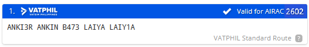

# RPVK - Kalibo International Airport

Fetching METAR...

## General
Kalibo International Airport has 1 Runway and 1 passenger terminal

- Main Terminal - Domestic, International and Cargo Flights 

The airport caters passenger and cargo flights, as well as general and military aviation.

## Charts
<iframe
  data-chart-src="https://vatphil.com/charts?icao=RPVK"
  title="RPVK Charts"
  loading="lazy"
  style="width:100%; height:750px; border:1px solid var(--md-default-fg-color--lightest); border-radius:8px;">
</iframe>

[Open charts in new tab](https://vatphil.com/charts?icao=RPVK){ .md-button .md-button--primary }

## Frequency List
<table>
  <thead>
    <tr>
      <th style="text-align:center">Designator</th>
      <th style="text-align:center">Callsign</th>
      <th style="text-align:center">Frequency</th>
      <th style="text-align:center">Remarks</th>
    </tr>
  </thead>
  <tbody>
    <tr>
      <td style="text-align:center"><strong>RPVK_ATIS</strong></td>
      <td style="text-align:center">Kalibo ATIS</td>
      <td style="text-align:center">127.800</td>
      <td style="text-align:center"></td>
    </tr>
    <tr>
      <td style="text-align:center"><strong>RPVK_TWR</strong></td>
      <td style="text-align:center">Kalibo Tower</td>
      <td style="text-align:center">124.200</td>
      <td style="text-align:center"></td>
    </tr>
    <tr>
      <td style="text-align:center"><strong>RPVK_APP</strong></td>
      <td style="text-align:center">Kalibo Approach</td>
      <td style="text-align:center">122.400</td>
      <td style="text-align:center">TMA 1500 ft - FL150</td>
    </tr>
  </tbody>
</table>

## Runways

Kalibo currently has 1 runway.
Below is a table of the Take-Off Run available

**Take-off Run Available.**

<table>
  <thead>
    <tr>
      <th style="text-align:center">Runway</th>
      <th style="text-align:center">TORA ft (m)</th>
    </tr>
  </thead>
  <tbody>
    <tr>
      <td style="text-align:center"><strong>06</strong></td>
      <td style="text-align:center">8,202 (2500)</td>
    </tr>
    <tr>
      <td style="text-align:center"><strong>24</strong></td>
      <td style="text-align:center">8,202 (2500)</td>
    </tr>
  </tbody>
</table>

## Routes

Local flights within RPHI and some international flights are to use routes given below. Simbrief also give a standard route which looks like this

If your route is still invalid, a controller will send you a private message with your new route. Routes within RPHI are to follow the half-moon principle in both RVSM and non-RVSM conditions. During events you will have 5 minutes between the time you request clearance and the time you request pushback, or you will have to wait until a new slot is available.

!!! warning

    During events it is important that you put your EOBT in your flight plan as controllers will use that to determine your takeoff slot.

## Waypoint Restrictions

<h3 style="text-align:center"><strong>Waypoint Restrictions</strong></h3>

<table>
  <thead>
    <tr>
      <th style="text-align:center">FIR</th>
      <th style="text-align:center">Waypoint</th>
      <th style="text-align:center">Airway</th>
      <th style="text-align:center">Altitude (FL)</th>
    </tr>
  </thead>
  <tbody>
    <tr>
      <td style="text-align:center"><strong>HONG KONG</strong></td>
      <td style="text-align:center"><strong>NOMAN / SABNO</strong></td>
      <td style="text-align:center"><strong>A583 / A461 / M501</strong></td>
      <td style="text-align:center"><strong>300 / 340 / 380</strong></td>
    </tr>
    <tr>
      <td rowspan="4" style="text-align:center"><strong>SINGAPORE</strong></td>
      <td style="text-align:center"><strong>TEGID</strong></td>
      <td style="text-align:center"><strong>M767</strong></td>
      <td style="text-align:center"><strong>310 / 320 / 350 / 360 / 390 / 400</strong></td>
    </tr>
    <tr>
      <td rowspan="3" style="text-align:center"><strong>LAXOR</strong></td>
      <td style="text-align:center"><strong>L649</strong></td>
      <td style="text-align:center"><strong>300 / 380</strong></td>
    </tr>
    <tr>
      <td style="text-align:center"><strong>M772</strong></td>
      <td style="text-align:center"><strong>300 / 380</strong></td>
    </tr>
    <tr>
      <td style="text-align:center"><strong>N884</strong></td>
      <td style="text-align:center"><strong>320 / 360 / 400</strong></td>
    </tr>
    <tr>
      <td rowspan="3" style="text-align:center"><strong>HO CHI MINH</strong></td>
      <td rowspan="2" style="text-align:center"><strong>PANDI / ARESI</strong></td>
      <td style="text-align:center"><strong>M765 / L628</strong></td>
      <td style="text-align:center"><strong>280 / 340</strong></td>
    </tr>
    <tr>
      <td style="text-align:center"><strong>N500</strong></td>
      <td style="text-align:center"><strong>300</strong></td>
    </tr>
    <tr>
      <td style="text-align:center"><strong>MIGUG</strong></td>
      <td style="text-align:center"><strong>N892</strong></td>
      <td style="text-align:center"><strong>310 / 320 / 350 / 360 / 390 / 400</strong></td>
    </tr>
  </tbody>
</table>

## Clearance

On first contact with the controller that will issue your clearance, it is recommended for you to give
the following information:

- Your bay number
- Your aircraft type

!!! warning

    Radio Checks on first contact are **discouraged** when building communication with the controller. 
    It's best to greet or ask the controller, should you need any help before clearance issuance.

    Be straightforward and concise as possible when communicating within a controlled frequency. 

Once you have requested for clearance, the controller will either tell you to standby, or give your clearance on the spot. Clearances include your routing, flight level restrictions, departure instructions and your squawk.

You must read back the clearance in full. Listen carefully to all details that the controller gives you, and if you are unsure about your clearance, **let the controller know.**

??? phraseology

    **CEB332**: Kalibo Tower, CEB332, Stand 5, A-3-2-0, request clearance Manila.

    **RPVK_TWR**: CEB332, cleared Manila, B473 LAIYA, RUNWAY 05 MINOR2P, Climb FL150, Squawk 4024

## Taxi

In Kalibo, expect to make a right-hand 180 turn to taxi to the runway.

??? phraseology "Phraseology"	

    **CEB332**: Kalibo Tower, CEB332, Stand 5, request taxi runway 05

    **RPVK_TWR**: CEB332, make 180, taxi B hold short 05

    **CEB332**: 180 to taxi B hold short 05, CEB332

## Departure

The departure procedure is decided by an online Approach (**APP**) or En-route Controller (**CTR**). When both are offline, Standard Instrument Departures (**SIDs**) are given by the aerodrome controllers (**TWR**, **GND** or **DEL**). When either **APP** or **CTR** is online, they decide if departures will be given radar vectors (climb and heading instructions) to the TMA exit points or will be following a **SID**.

When **APP** or **CTR** is online, after passing 2000 feet or 5 DME from RPVK, report your passing altitude to **APP**  or **CTR**. This is to help them identify you successfully in their radar screens.

??? phraseology "Phraseology"

    **CEB332**: Kalibo Approach, CEB332, passing 2000, climbing FL150, MINOR2P

    **RPVK_APP**: CEB332, radar identified, continue climb FL150

## Arrival

When arriving into Kalibo, it is best for you to be by FL140  when reaching the border of the TMA by the North or 9000 feet when reaching the border of the TMA by the South or the start of the STAR. On initial contact with Kalibo Approach (RPVK_APP), report your current level.

??? phraseology "Phraseology"

    **CEB331**: Kalibo Approach, CEB331, FL140, inbound TAPER

APP will then issue your arrival clearance including the type of approach to expect to the active runway. APP either gives you radar vectors to final or gives you descent clearances via a STAR.

??? phraseology "Phraseology"

    **RPVK_APP**: CEB331, radar contact, cleared Kalibo TAPER1A expect RNP Z 05

    **CEB331**: Cleared Kalibo TAPER1A expect RNP Z 05, CEB331

    **RPVK_APP**: CEB331, descend via STAR 8,000, QNH 1011

    **CEB919**: descend via STAR 8,000, QNH 1011, CEB331

!!! warning

    If APP didn’t give you any turns after you have passed the last waypoint on your routing, maintain your present heading.

[^1]: Controls RPVE, RPVK and RPVR

*[GA]: General Aviation
*[EOBT]: Estimated off block time
*[TOBT]: Target off block time
*[TSAT]: Target start approval time
*[ASRT]: Actual start up time
*[TTOT]: Target takeoff time
*[CTOT]: Calculated takeoff time
*[RPVK_TWR]: Kalibo Tower
*[RPVK_APP]: Kalibo Approach
