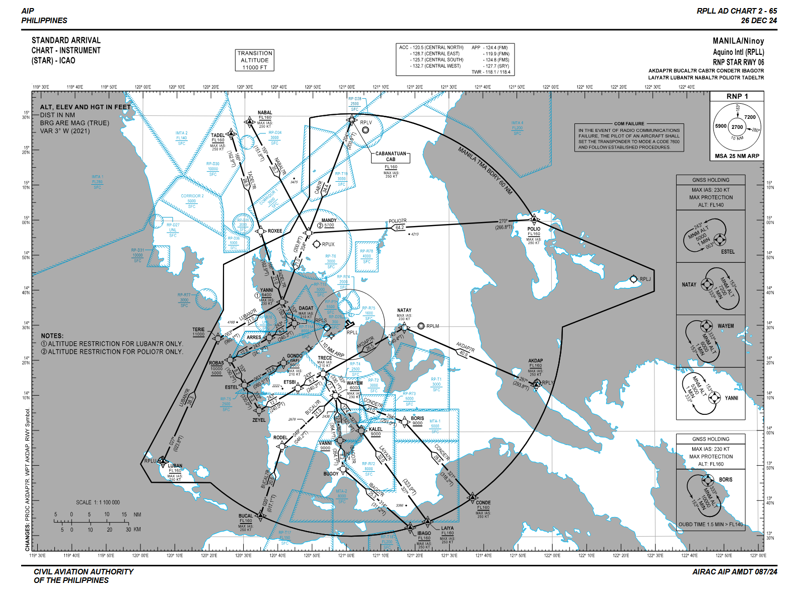

# Standard Instrument Departure route (SID)

A **Standard Instrument Departure route** or  **SID**, is a flight route defined and published by an ```air navigation service provider``` that details how an IFR flight should proceed from the take-off phase to en-route phase.

A typical SID consists of a **set** of waypoints points, and a description of routes (typically via VORs and RNAV waypoints) to the **exit point of the TMA** and subsequently join an airway en-route to their destination. 


*Example of SIDs of Ninoy Aquino International Airport*


# Standard Terminal Arrival Routes (STARs)

A **Standard Terminal Arrival Route** or  **STAR**, is a flight route defined and published by an ```air navigation service provider``` that details how an aircraft should proceed from the en-route phase to an initial approach fix.

A typical STAR consists of a **set** of starting points, called **Transitions**, and a description of routes (typically via VORs and RNAV waypoints) from each of these transitions to the **initial approach fix**. Upon reaching said fix, the aircraft can join the instrument approach (IAP).



*Example of STARs of Ninoy Aquino International Airport*