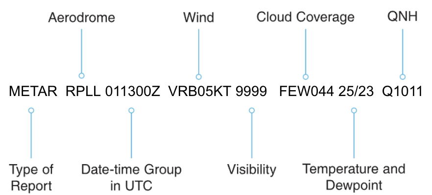

# Weather
To be added

## Meteorological Aerodrome Report (METAR)

An aviation MET REPORT, or METAR (Meteorological Aerodrome Report), is a standard format weather report, issued by most major aerodromes every 30 or 60 minutes during their period of operation, which provides a brief outline of current weather conditions, including wind speed and direction, visibility, clouds, temperature, pressure and runway conditions.
A special weather report (SPECI) is issued as necessary to update a METAR when there has been a significant change to the weather conditions. SPECIs and METARs share the same coding. Both types of report detail the following information in a series of code groups which always appear in the same order.

### Decoding a METAR

**METAR** - Actual weather report  
**RPLL** - Report for Manila  
**011300Z** - Reported on the 1st of the month at 13:00Z  
**VRB05KT** - Wind Variable 5 knots  
**9999** - Visibility more than 10 kilometres  
**FEW044** - Few Clouds at 4 400 ft  
**25/23** - Temperature 25°C, Dew Point 23°C  
**Q1011** - QNH 1011

## Terminal Aerodrome Forecast (TAF)

The terminal aerodrome forecast (TAF) is a forecast (not a report) of expected conditions. TAFs describe the forecast conditions at an aerodrome and cover a period of not less than 6 hrs and not longer than 30 hrs. Routine TAFs valid for less than 12 hrs are issued every 3 hrs, and those valid for 12 up to 30 hrs every 6 hrs. Most of the coding for a TAF is similar to a METAR. The most obvious difference is the date-time group because it now includes a period of validity as well as a report issue time.  

??? weather "TAF"

    === "TAF"

        **TAF RPLL 311800Z 3118/0103** 
        
        This TAF was issued for Manila airport on the 31st of the month at 18:00 hours UTC and covers the nine hour period from 18:00 hours on the 31st day to 03:00 hours on the 1st day of the following month. A 30 hr TAF is also issued in many countries. This format can have a slightly different date time group code.

    === "TAF AMD"

        **TAF AMD RPLL 152335Z 1600/1706**

        This indicates that the TAF was issued on the 15th of the month at 23:35Z and will be valid from 00:00 on the 16th to 06:00 on the 17th. The code word AMD is used if the TAF is amended, COR if the TAF is corrected, NIL if the TAF is missing and the code word CNL if the TAF is cancelled.