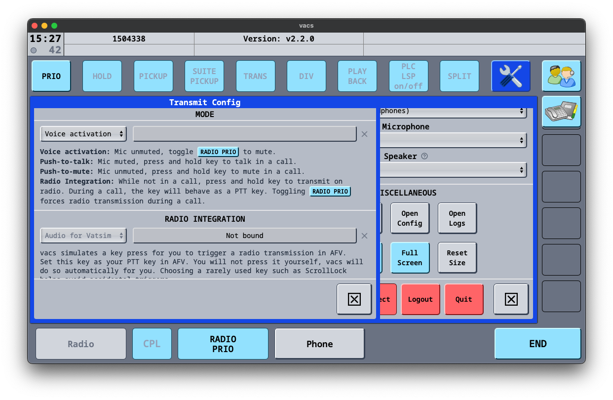
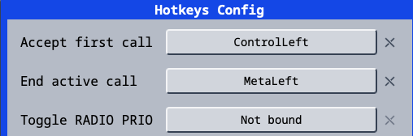

# VACS: A Summary

VACS is an external communication tool that enables two-way communication between controllers, created by Nick Müller. It is arguably simpler than searching for who is on a position, finding them on TeamSpeak and moving channels — simply click the position you wish to coordinate with and initiate a phone call.

Upon receiving a call, VACS will sound a dialing tone for 2 seconds and will repeat until the call is either answered or terminated.

---

## How to Access and Use VACS

### Accessing VACS

You can access VACS through the **External Program Only**. The inbuilt EuroScope program does not work with VACS. The VACS installer can be downloaded [here](https://github.com/MorpheusXAUT/vacs/releases).

---

### How to Set Up VACS

#### Configuring Audio

> **Note:** Before changing certain audio settings, the volume indicator for your input needs to be deselected, otherwise it will suggest that a call is ongoing.

On the audio settings screen, you can change all audio settings — from your input volume to the volume of the inbound call tone.

<figure markdown="span">
  { width="300" }
  <figcaption>You can set your transmit mode by going to Settings → Transmit. The Transmit page also includes an explanation of how each Transmit Mode works.</figcaption>
</figure>

??? tip "Voice activation is the most realistic mode of transmission for PH controllers."

<figure markdown="span">
  { width="300" }
  <figcaption>Hotkeys are a useful way to accept and deny incoming calls without having to open the VACS program each time. To set your hotkeys, go to Settings → Hotkeys.</figcaption>
</figure>


> **Note:** You can set both Hotkeys to the same key, allowing you to accept and end calls using the same button.

---

## Communicating with Other Controllers

### Coordination Etiquette

??? info "How should I initially speak to the controller that I'm coordinating with?"
    The person answering the call should identify themselves **first** — for example, "Manila Control". The calling controller will then identify themselves and pass their message.

??? info "What should I do if the controller I am calling does not answer?"
    You should wait a few minutes as they may be busy. They may call you back. If they don't, try calling them again.

??? info "I can hear the other controller speaking on their frequency — is this meant to happen?"
    Yes. The other controller may be using voice activation in their audio settings, so you may hear them talking on their frequency. This is standard practice in the real world too, so you know when it's not a good time to talk.

---

### Using VACS

The main panel is what you will see 90% of the time. There are 4 main buttons:

{ align=left }
**Mission**  
Takes you to the menu where you can change the view of your panel.

<div style="clear: both;"></div>

{ align=left }
**Phonebook**  
Opens a phonebook-styled menu showing a list of people that called you, the time of the call, and whether it was inbound or outbound. You can also dial a controller by their CID or add them to your ignored list.

<div style="clear: both;"></div>

{ align=left }
**Settings**  
The settings menu. Used for audio settings, hotkeys, and transmission methods.

<div style="clear: both;"></div>

{ align=left }
**End Call**  
Ends the current call.

<div style="clear: both;"></div>

---

### Changing Profiles

VACS does not automatically group positions based on where you are controlling — grouping must be done manually.

To change your profile, click the **Profiles** button, navigate to **Profiles**, and select the region or aerodrome you are currently controlling in.

> **Note:** When opening the Profiles page for the first time, it may appear blank as no profiles have been imported. To resolve this, press **Select Stations Config**, then select the `VATPHIL` file located inside the vatphil sector file folder in your EuroScope installation.

---

### Calling

#### Accepting a Call

> **Warning:** Before you identify yourself, wait for the dot in the top left corner to turn **green**. This establishes that there is a connection between the two stations.

To accept an incoming call, click the **flashing green station**. Alternatively, use the hotkey assigned to accepting calls. To end the call, press the **End** button or the hotkey assigned to ending calls.

#### Making a Call

To make a call, simply press the controller you would like to call. On most profiles, area positions will be aliased (e.g. *Manila Control* will show as *MNL CTR* on all profiles that contain it). If you are unsure who an alias will call, check the frequency mapping in the profiles menu.

> **Note:** You will only see controllers who are **online AND using VACS**.

## Wiresign

Each controller is assigned a personal **wiresign** — a short phonetic identifier.

> Example: `John Doe` → **Juliet Delta** &nbsp;

Wiresigns are appended at the end of acknowledgements and readbacks of important messages (clearances, flight levels, direct routings).

---

## Basic Call Format

Address the **called station first**, then identify yourself, then state your request:

```
[Called Station], [Your Station], [Request/Info]
```
 
> Because VACS shows caller ID, self-identification may be dropped once both parties know who they're speaking to.
 
---
 
## Phraseology
 
??? phraseology "Answering a Call"
 
    Wait for the **top-left dot to turn green** before speaking — this confirms the connection is established.
 
    The controller **answering** the call identifies themselves first:
 
    ```
    "[Your Station]"
    ```
 
    The calling controller then identifies themselves and passes their message:
 
    ```
    "[Your Station], [Request/Info]"
    ```
 
    **Example — APP calls CTR:**
    ```
    CTR answers: "Manila Control"
    APP: "Approach, CEB911 request direct IPATA"
    CTR: "Approved, direct IPATA"
    ```
 
??? phraseology "Transfer of Information / Coordination"
 
    State the called station, your station (if needed), then the coordination item. Responses should be as brief as possible.
 
    **Approach → Control**
    ```
    Initiate: "Manila Approach, Control, CEB911 request direct IPATA"
    Response: "Approved, direct IPATA" / "Approved"
    ```
 
    **Ground → Tower (runway crossing)**
    ```
    Initiate: "Request crossing Runway 31"
    Response: "Approved" / "Standby"
    ```
 
    **Cross-facility (e.g., Tambler → Kalibo)**
    ```
    Initiate: "Kalibo, Tambler, request direct routing CEB992"
    Response: "Approved" / "Approved, direct CEB992"
    ```
 
    For important items (clearances, flight levels, direct routes), **read back and sign off with your wiresign**:
    ```
    "Direct IPATA approved. -Lima Kilo"
    "Readback, direct IPATA approved. -Juliet Alpha"
    ```
 
    For routine approvals, wiresign is optional — a plain **"Approved"** is sufficient.
 
??? phraseology "Mic Check"
 
    ```
    "Line Check"
    ```
 
---
 
- **Called station first**, then your station, then the request
- **Answering controller identifies first** when picking up
- Informal language is fine — what matters is clarity
- Keep calls **short** — say what needs to be said and end the call
---
 
## Quick Reference
 
| Situation | Caller says | Responder says |
|---|---|---|
| Answering a call | *(wait for green dot)* | `"[Your Wiresign]"` |
| APP → CTR coordination | `"[CTR], [APP], [AC] request [info]"` | `"Approved"` / `"Approved, [readback]"` |
| GND → TWR runway crossing | `"Request crossing [RWY]"` | `"Approved"` / `"Standby"` |
| Readback w/ wiresign | — | `"[Readback]. -[Wiresign]"` |
| Mic check | `"Line Check"` | `"Line Check"` |