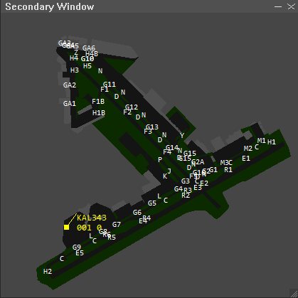

# Secondary Window

Secondary Window is a small floating window that sits on top of EuroScope.
It shows your maps (ground layouts, airspace, sectors, fixes) and live
traffic in their own window, so you can keep a clean second view open while
you work the main radar.

## Getting started

1. Open the folder you were given. It contains three files:
   `SecondaryWindow.dll`, `SecondaryWindowMap.txt`, and
   `SecondaryWindowSettings.txt`. Keep all three together in the same folder.
2. In EuroScope, open **Other Set**, then **Plugins**, then **Load**, and
   pick `SecondaryWindow.dll`.
3. A small window titled *Secondary Window* appears above EuroScope.

That is it. The window stays on top so it always feels part of your layout.

## The window

Along the top of the window you will find a title bar with three buttons on
the right side:

* The **list** button opens the sidebar, where you choose what to show and
  reach every action.
* The **minus** button collapses the window down to just the title bar.
  Click it again to bring it back.
* The **X** button hides the window. Type `.sw show` in the EuroScope chat to
  bring it back.

You can move the window by dragging the title bar, and resize it by dragging
the small grip in the bottom right corner.

## Moving around the map

* **Pan:** hold the **right** mouse button and drag inside the map.
* **Zoom:** scroll the mouse wheel.

The left mouse button is kept free for tags and the measuring tool, so a left
click on empty map space does nothing.

## Choosing what to show (the sidebar)

Click the **list** button in the title bar to open the sidebar. The top of
the sidebar has a row of action buttons, and below that is your list of maps.

Maps are grouped into folders such as `GEO`, `REGIONS`, `ESE`, and per
airport folders like `ESE/RPLL`. Click a folder to expand or collapse it.
Tick a map to show it, untick to hide it. Your choices are remembered for
each window, so the next time you load EuroScope everything comes back the
way you left it.

### Sidebar buttons

* **Hide all** and **Show all:** hide or show every map at once.
* **Load .asr:** pick one of your EuroScope `.asr` files and the window
  shows the same maps that `.asr` had turned on.
* **Altitude filter:** open a small box where you set a minimum and maximum
  altitude in feet. Traffic outside that band is hidden. You can also clear
  it back to no filter.
* **Hide aircraft on ground:** turn this on to hide slow targets so parked
  and taxiing aircraft stop cluttering the view.
* **Open new window:** open another Secondary Window (up to five). It starts
  blank so you can build a different view.
* **Reload maps** and **Reload settings:** re read your files from disk after
  you have edited them.

## Traffic and tags

Each aircraft shows as a dot with a short label (a tag) beside it. The tag
can show the callsign, altitude, speed, and more, depending on how the
settings file is set up.

You can drag any tag to move its label away from the dot, which helps when
two aircraft sit close together. A thin line connects the moved tag back to
its dot so you always know which is which. The position you set lasts for the
session.

## Measuring distance and bearing

To measure between two points, **double click** on the map and, without
letting go, **drag** to the second point. A line appears showing the distance
in nautical miles and the bearing.

When you let go, the measurement stays on screen so you can read it. It
disappears the moment you left click anywhere again.

## Waypoints (fixes)

If your sector file includes fixes, they appear as a layer called `FIXES` in
the sidebar. Tick it to show every fix as a small triangle with its name
beside it. It starts hidden, so turn it on when you want it.

## Using more than one window

You can have up to five Secondary Windows open at once. Each one keeps its
own position, size, zoom, altitude filter, and its own set of visible maps.
A common setup is one window zoomed in on a ground layout and another showing
the wider airspace.

Open another window from the sidebar **Open new window** button, or by typing
`.sw new` in the EuroScope chat.

## Quick chat commands

Type these in the EuroScope command line.

| Command              | What it does                                      |
| -------------------- | ------------------------------------------------- |
| `.sw reload`         | Re read your map and settings files               |
| `.sw new`            | Open another Secondary Window                     |
| `.sw show`           | Bring back any hidden windows                     |
| `.sw hide`           | Hide all windows                                  |
| `.sw save`           | Save your current layout right now                |
| `.sw alt 3000 24000` | Set the altitude filter on every window (in feet) |
| `.sw alt off`        | Clear the altitude filter on every window         |

## Changing colors and tag text

Most of the look is controlled by `SecondaryWindowSettings.txt`. You can open
it in any text editor and change things like the background color, the
traffic dot color, the tag font, and what each tag line shows. Every line has
a short comment next to it explaining what it does.

After you save your changes, type `.sw reload` in the EuroScope chat (or use
the **Reload settings** button in the sidebar) and the window updates right
away. If something does not look right, the original values are written next
to each setting, so you can always put them back.

## If a window goes missing

If you close a window with the **X** and want it back, type `.sw show`. If you
want to start fresh with a single default window, close EuroScope and delete
the file `SecondaryWindowState.txt`, then start again.

---
